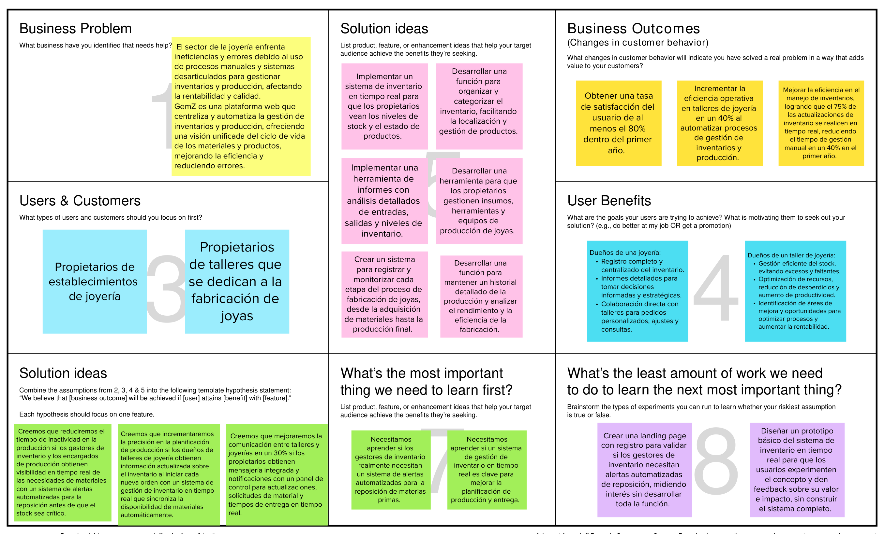

# **Capítulo I: Introducción**
## 1.1. Startup Profile
## 1.1.1. Descripción de la Startup

GemZ es una innovadora solución de software desarrollada por el equipo FullStackFury, destinada a transformar la gestión de procesos e inventario en el sector de la joyería. Este producto busca apoyar un modelo de negocio independiente y sostenible, brindando herramientas especializadas tanto para propietarios de talleres de joyería como para dueños de joyerías, con o sin talleres.
Para los propietarios de talleres, GemZ ofrece un control exhaustivo sobre cada etapa del proceso de producción de joyas, desde la adquisición de insumos hasta la entrega del producto final. La aplicación permite a los usuarios monitorear en tiempo real procesos críticos como el diseño, la limpieza, el engaste y el pulido, garantizando una producción eficiente y de alta calidad.
Por otro lado, los propietarios de joyerías pueden utilizar GemZ para gestionar de manera efectiva el inventario de productos terminados, optimizando la organización y disponibilidad de las piezas. La capacidad de seguimiento y control que proporciona la aplicación permite a ambos segmentos superar desafíos comunes en el sector, mejorando la eficiencia operativa y reduciendo los márgenes de error.
GemZ se presenta así como una herramienta esencial para los profesionales de la joyería, ofreciendo una solución completa que se adapta a las necesidades específicas de la industria, impulsando la productividad y el crecimiento sostenible de sus negocios.

## 1.1.2. Perfiles de integrantes del equipo

<table>
  <tr>
    <th colspan="2">Antayhua Castillo, Oscar Josué</th>
  </tr>
  <tr>
    <td></td>
    <td>Nací el 20 de diciembre de 2001 y estudio la carrera de Ingeniería de Software en la Universidad Peruana de Ciencias Aplicadas (UPC). La razón por la cual escogí esta carrera es debido a la alta demanda que esta tiene, además de todas las posibilidades que el crear un software permite. Durante mi primer año de carrera desarrollé mis habilidades, programando distintos trabajos, además de aprender todo lo básico que la programación conlleva. Tengo distintos pasatiempos tales como jugar videojuegos, escuchar música, ver series y practicar basketball.</td>
  </tr>
  <tr>
    <th colspan="2">Quijandria Araneda, Vicente </th>
  </tr>
  <tr>
    <td></td>
    <td>Mi nombre es Vicente Quijandria, tengo 24 años y estudio Ingeniería de Software en la UPC. Me apasiona mucho el desarrollo de aplicaciones, los algoritmos y estructuras de datos y las arquitecturas de software.
    Actualmente trabajo como Analista de Despliegues en la empresa Tech-Mahindra aunque me gustaria cambiar de área a desarrollo.
    En mis tiempos libres me gusta ver futbol, programar y pasar tiempo de calidad con mi enamorada, familia y amigos.
  </td>
</tr>
  <tr>
    <th colspan="2">Renteria Palacios, Yasser</th>
  </tr>
  <td></td>
    <td>Soy estudiante de Ingeniería de Software en la Universidad Peruana de Ciencias Aplicadas (UPC), apasionado por la programación y el aprendizaje continuo de nuevos lenguajes de programación. Mi mayor anhelo es desarrollar un videojuego, combinando mi amor por la tecnología y la creatividad. En mi tiempo libre, disfruto de jugar videojuegos, viajar y sumergirme en nuevas culturas, buscando siempre experiencias que enriquezcan tanto mi vida personal como profesional.</td>
  <tr>
    <th colspan="2">Curi Marcelo, Angelo Marcio</th>
  </tr>
  <tr>
    <td></td>
    <td>Soy estudiante de Ingeniería de Software en la Universidad Peruana de Ciencias Aplicadas (UPC), con conocimientos en lenguajes de programación como C++ y Python. Además, manejo herramientas que apoyan el desarrollo eficiente de proyectos de software. Siempre me esfuerzo por adquirir nuevas habilidades y mejorar mis competencias técnicas para afrontar los desafíos del desarrollo de software. Me considero una persona responsable, comprometida y enfocada en la calidad del trabajo. Tengo la capacidad de adaptarme rápidamente a nuevas tecnologías y entornos. Cumplo con los plazos establecidos y tengo una gran disposición para aprender y colaborar en equipo. Estoy seguro de que mi actitud proactiva me permitirá aportar de manera significativa al equipo.</td>
  <tr>
    <th colspan="2">Torres García, Andrés Alberto
  </th>
  </tr>
  <tr>
    <td></td>
    <td>Hola, soy Andrés Alberto Torres García, estudiante de 19 años en el quinto ciclo de Ingeniería de Software. Siempre me ha interesado tecnología, siempre me he preguntado cómo funcionan las cosas, lo que me motiva a ir más allá de lo que se me enseña en clase. Esta curiosidad me impulsa a explorar cada detalle, ayundome ampliar mis conocimiento y definir mejor mi enfoque profesional.Además de la tecnología, el fútbol es otra de mis grandes pasiones, lo he practicado durante prácticamente toda mi vida. La dedicación al deporte me ha enseñado el valor del trabajo en equipo, la disciplina y la perseverancia, cualidades que aplico también en mi vida académica y profesional.
  </td>
</table>

## 1.2. Solution Profile

GemZ es una solución de software creada por FullStackFury que revoluciona la gestión de procesos e inventarios en la industria de la joyería. Está diseñada tanto para quienes tienen talleres de joyería como para los dueños de joyerías, permitiéndoles controlar de manera detallada cada etapa de la producción, desde la adquisición de materiales hasta la entrega del producto final, así como gestionar eficientemente su inventario. Con su capacidad para monitorear en tiempo real y mejorar la eficiencia operativa, GemZ facilita la superación de los retos habituales en este sector, reduciendo errores y apoyando un modelo de negocio sostenible que se adapta a las necesidades particulares de la joyería.

## 1.2.1 Antecedentes y problemática

### Los 5 'W' y 2 'H'

#### **What (Qué)**
**¿Cuál es el problema?**
El problema radica en la falta de herramientas especializadas para la gestión eficiente de los procesos de producción y el manejo de inventarios en la industria de la joyería. Los propietarios de talleres y joyerías a menudo enfrentan dificultades para mantener un control detallado sobre las distintas etapas de producción y la organización del inventario. Aunque existen soluciones genéricas, estas no se adaptan a las necesidades específicas de la joyería, lo que resulta en procesos ineficientes, mayor margen de error, y pérdidas de recursos y tiempo.

#### **When (Cuándo)**
**¿Cuándo sucede el problema?**
El problema se manifiesta durante las operaciones diarias de los talleres y joyerías, particularmente cuando los propietarios intentan gestionar múltiples procesos de producción o mantener un inventario actualizado. La falta de una solución centralizada y especializada se vuelve evidente en momentos críticos como la producción en masa o la preparación de pedidos, donde la precisión y la eficiencia son esenciales para evitar retrasos y errores.

#### **Where (Dónde)**
**¿A dónde se dirige?**
Nuestra solución está dirigida a los propietarios de talleres de joyería y dueños de joyerías, independientemente de si cuentan con un taller propio.

**¿Dónde surge el problema?**
El problema surge en el entorno operativo de los talleres de joyería, donde se requiere un control detallado de cada etapa de producción, y en las joyerías, donde es crucial una gestión precisa del inventario para satisfacer la demanda de los clientes sin comprometer la calidad.

#### **Who (Quién)**
**¿Quiénes están involucrados? ¿Quién lo utilizará?**
Los involucrados son principalmente los propietarios de talleres de joyería y dueños de joyerías. La solución será utilizada por estos profesionales que necesitan una herramienta para gestionar eficientemente sus procesos de producción, así como su inventario, con el fin de optimizar sus operaciones y mejorar la calidad del servicio al cliente.

#### **Why (Por qué)**
**¿Cuál es la causa del problema?**
La causa del problema radica en la falta de herramientas tecnológicas adaptadas específicamente a las complejidades de la industria de la joyería. Los procesos de producción de joyas son altamente detallados y requieren un monitoreo constante, lo cual no es soportado adecuadamente por las soluciones genéricas existentes. Además, la falta de una herramienta integrada que conecte el flujo de trabajo desde la producción hasta la gestión de inventario crea ineficiencias que afectan la productividad y la rentabilidad del negocio.

#### **How (Cómo)**
**¿Cómo se utilizará el producto?**
El producto será utilizado para gestionar de manera centralizada y en tiempo real todos los aspectos de la producción de joyas y la gestión de inventario. Los usuarios podrán registrar cada etapa del proceso de producción, monitorear el progreso, y gestionar el inventario de productos terminados. La plataforma permitirá un control exhaustivo y detallado de las operaciones, facilitando la toma de decisiones informadas y la mejora continua de los procesos.

**¿Cómo se logrará una gestión adecuada de los procesos y una comunicación eficiente entre los diferentes roles en la joyería?**
La gestión adecuada se logrará mediante una interfaz amigable que permita a los usuarios monitorear cada etapa del proceso de producción en tiempo real, desde la adquisición de materiales hasta la entrega final del producto. La comunicación interna entre los diferentes roles (como diseñadores, artesanos y gerentes de inventario) se facilitará a través de herramientas de mensajería y notificaciones integradas en la plataforma, asegurando que todos los miembros del equipo estén alineados y que las operaciones fluyan sin interrupciones.

#### **How much (Cuánto)**
**¿Cuál es la magnitud del problema?**
El problema es significativo, ya que afecta directamente la eficiencia operativa, la calidad del producto, y la rentabilidad de los negocios en la industria de la joyería. Sin una herramienta adecuada, los talleres y joyerías enfrentan un mayor riesgo de errores en la producción y desorganización en el manejo del inventario, lo que puede traducirse en pérdidas financieras y la insatisfacción de los clientes.

## 1.2.2 Lean UX Process.
## 1.2.2.1. Lean UX Problem Statements.

El estado actual del sector de la joyería se ha centrado principalmente en los dueños de joyerías y talleres de joyería, quienes enfrentan puntos críticos en la falta de un control organizado de las actividades realizadas por los joyeros y engastadores. Además, no se registra o se conoce en detalle qué herramientas o materiales utiliza cada trabajador al iniciar la creación de una joya.
Lo que los productos/servicios existentes no logran abordar es la necesidad de fiabilidad, adaptabilidad y facilidad de uso para trabajadores de todas las edades.
Nuestro producto/servicio abordará esta brecha mediante una interfaz intuitiva y dinámica que se adapta a cualquier grupo de edad, ofreciendo una solución más fiable y adaptable a las necesidades del mercado actual y de nuestros segmentos objetivos.
Nuestro enfoque inicial será los trabajadores de joyería desde los 18 años hasta la edad de jubilación, sin distinción de género, que trabajen en talleres o en joyerías.
Sabremos que tenemos éxito cuando veamos que los trabajadores encuentran la aplicación fácil de usar para registrar sus actividades, y que los dueños tienen un control detallado y actualizado de todas las operaciones realizadas en el taller.

## 1.2.2.2. Lean UX Assumptions.

### Business Assumptions:
Creemos que los dueños de joyerías y talleres de joyería están abiertos a adoptar herramientas digitales para mejorar la gestión de su inventario y procesos de fabricación.

Asumimos que las joyerías buscan soluciones eficientes y están dispuestas a pagar por herramientas que les ayuden a optimizar sus operaciones y a reducir errores en la producción.

Sabemos que los talleres de joyería necesitan una gestión precisa de materiales y recursos, y valoran la capacidad de rastrear el progreso de cada pedido de manera efectiva.

Asumimos que tanto joyerías como talleres tienen acceso a dispositivos con internet y están dispuestos a usar una aplicación para gestionar su inventario y procesos.

Creemos que una plataforma que centraliza la gestión de inventario y procesos de fabricación puede reducir el tiempo perdido y mejorar la precisión, lo que resultará en un ahorro significativo para los usuarios.                                                    
Sabemos que la plataforma proporcionará un entorno seguro para los datos de inventario y transacciones, lo que generará confianza entre los usuarios.

Creemos que los dueños de joyerías y talleres verán valor en la planificación y el seguimiento del inventario y procesos a largo plazo mediante la plataforma.

Tanto las joyerías como los talleres pueden ahorrar tiempo y reducir costos al simplificar la gestión de inventario y procesos mediante GemZ.

### Business Outcomes Assumptions

- Mejorar la experiencia de usuario de nuestra aplicación web resultará en un aumento de la suscripción de joyerías y talleres, lo que incrementará los ingresos.
- Ofrecer una plataforma adaptable y fácil de usar mejorará la satisfacción y lealtad de los usuarios a largo plazo.
- Garantizar la seguridad y confidencialidad de los datos de los clientes generará confianza y credibilidad en la comunidad de usuarios.
- Desarrollar una interfaz intuitiva y amigable para el usuario aumentará el compromiso y la frecuencia de uso de la plataforma.
- Implementar estrategias de marketing efectivas dirigidas a joyerías y talleres impulsará la adquisición de clientes y el crecimiento del negocio.
- Diferenciar nuestro servicio de los competidores a través de un enfoque especializado en la gestión del sector joyero establecerá una propuesta de valor única y atraerá a un público más amplio.
- Construir una sólida comunidad en línea entre joyerías y talleres fomentará la interacción, el apoyo mutuo y la fidelidad hacia la plataforma GemZ.

### User Assumptions:

#### Segmento de Dueños de Joyerías:

- Los dueños de joyerías buscan una solución integral que no solo les permita gestionar eficientemente su inventario, sino también colaborar de manera fluida con los talleres, reconociendo la importancia de una comunicación clara para optimizar sus procesos.
- Valoran la conveniencia y accesibilidad de una plataforma que puedan utilizar desde cualquier lugar y en cualquier momento, especialmente cuando están manejando múltiples tiendas o proveedores.
- Están dispuestos a invertir en un servicio especializado que les ofrezca comunicación directa y personalizada con los talleres, sintiéndose más seguros y comprometidos cuando pueden gestionar sus necesidades específicas en tiempo real.
- Esperan que la plataforma sea adaptable a las particularidades de su negocio, permitiéndoles ajustar fácilmente el seguimiento de inventarios y procesos según sus necesidades cambiantes.
- Los dueños de joyerías valoran la transparencia y la confiabilidad de la plataforma, buscando garantías de que los datos de sus clientes y su negocio serán tratados de forma segura y confidencial.

#### Segmento de Propietarios de Talleres de Joyería:

- Los propietarios de talleres buscan una plataforma que les permita ampliar su alcance, conectándose con una mayor cantidad de joyerías y ofreciendo sus servicios de forma eficiente y efectiva.
- Valoran la oportunidad de establecer una comunicación directa y personalizada con sus clientes (dueños de joyerías), lo que les permite adaptar sus servicios a las necesidades y requerimientos específicos de cada joyería.
- Están interesados en una plataforma que les proporcione herramientas para optimizar su trabajo, como la posibilidad de gestionar pedidos, realizar seguimientos detallados del estado de producción, y acceder a reportes que les permitan mejorar su operación.
- Buscan una plataforma con una experiencia de usuario intuitiva y amigable, que les permita navegar rápidamente y acceder a la información y funciones necesarias para ofrecer un servicio de alta calidad.
- Valoran la seguridad y confidencialidad en una plataforma online, esperando que tanto sus datos como la información de sus clientes sean protegidos, y que la plataforma cumpla con los estándares de privacidad y seguridad establecidos en la industria.

### User Outcomes Assumptions:

#### Segmento de Dueños de Joyerías:

- Los dueños de joyerías experimentarán una mayor satisfacción y eficiencia en la gestión de su inventario y procesos al recibir herramientas especializadas y soporte continuo a través de la plataforma.
- Se sentirán satisfechos con la flexibilidad de la plataforma, que les permitirá personalizar la gestión de inventarios y el seguimiento de pedidos según sus necesidades específicas.
- Confiarán en la seguridad y confidencialidad de los datos de su negocio, lo que les dará tranquilidad al gestionar información sensible dentro de la plataforma.
- Disfrutarán de una experiencia intuitiva y amigable en GemZ, lo que les permitirá navegar de manera fluida y acceder rápidamente a los recursos y herramientas necesarios para optimizar sus operaciones diarias.

#### Segmento de Propietarios de Talleres de Joyería:

- Los propietarios de talleres encontrarán la plataforma fácil de usar y eficiente para ofrecer un servicio personalizado a sus clientes (dueños de joyerías), mejorando la comunicación y la colaboración en cada proyecto.
- Apreciarán la capacidad de adaptar y personalizar los procesos de producción y los tiempos de entrega para cada joyería, lo que aumentará su efectividad y reputación en el mercado.
- Confiarán en las medidas de seguridad de la plataforma para proteger la información de sus clientes y mantener la confidencialidad, asegurando un entorno de trabajo profesional y seguro.
- Se beneficiarán de una interfaz simplificada y herramientas que faciliten la comunicación y el seguimiento de pedidos, permitiéndoles concentrarse más en la producción y menos en tareas administrativas.

## 1.2.2.3. Lean UX Hypothesis Statements.
**Hypothesis 1: Optimización de la producción en talleres**

**Creemos que lograremos** un aumento del 15% en la eficiencia de la producción de joyas

**Si** los propietarios de talleres de joyería

**Consiguen** realizar un seguimiento detallado de cada etapa del proceso de producción y tener visibilidad en tiempo real del estado de cada pieza

**Con** la funcionalidad de seguimiento de producción de GemZ.

**Hypothesis 2: Mejora en la gestión de inventario en joyerías**

**Creemos que lograremo**s una reducción del 10% en las pérdidas de inventario por falta de seguimiento o errores humanos

**Si** los dueños de joyerías

**Consiguen** registrar y actualizar fácilmente su inventario de joyas, con alertas automáticas de stock bajo

**Con** el sistema de gestión de inventario de GemZ

**Hypothesis 3: Mayor satisfacción del cliente en joyerías**

**Creemos que lograremos** un aumento del 20% en la satisfacción del cliente

**Si** los dueños de joyerías

**Consiguen** responder rápidamente a las consultas de los clientes sobre la disponibilidad de joyas específicas

**Con** la función de búsqueda y visualización de inventario en tiempo real de GemZ
## 1.2.2.4. Lean UX Canvas.

El Lean UX Canvas permite al equipo organizar sus ideas y suposiciones sobre los usuarios y sus necesidades, alineando a todos en torno a los objetivos del proyecto. Este enfoque facilita la identificación de los problemas clave, la priorización de acciones y la definición de métricas de éxito, lo que ayuda a crear soluciones efectivas mediante ciclos rápidos de validación y aprendizaje continuo.

URL: https://app.mural.co/t/teacsykawsai8308/m/teacsykawsai8308/1724298218177/08cc14a22fc6f4164dbe3f3a5ef46074d31ae68c?sender=uc4019db9bc166bf541b07012

## 1.3. Segmentos objetivo.
**Propietarios de talleres de joyería:**

| **Segmento Objetivo / Características** | **Persona objetivo** |
|-----------------------------------------|----------------------|
| **Geográfico**                          | - **Ubicación del taller:** Urbana, suburbana, rural. - **Tamaño del taller:** Pequeño, mediano, grande. - **Tamaño del equipo:** Talleres unipersonales, talleres con varios empleados. |
| **Demográfico**                         | - **Edad:** Jóvenes emprendedores, artesanos experimentados. - **Nivel educativo:** Formación técnica en joyería, autodidactas. - **Tamaño del equipo:** Talleres unipersonales, talleres con varios empleados. |
| **Psicográfico**                        | - **Motivaciones:** Pasión por la joyería, deseo de independencia, tradición familiar. - **Estilo de trabajo:** Artesanal, enfocado en la calidad, orientado a la producción en masa. - **Preocupaciones:** Control de costos, eficiencia en la producción, gestión de inventario de insumos. |

**Dueño de joyerías (con o sin taller):**
| **Segmento Objetivo / Características** | **Persona objetivo** |
|-----------------------------------------|----------------------|
| **Geográfico**                          | - **Ubicación de la joyería:** Centro comercial, calle principal, barrio exclusivo. - **Tamaño de la joyería:** Pequeña, mediana, grande. - **Zona geográfica:** Zonas comerciales, áreas céntricas, distritos de lujo. |
| **Demográfico**                         | - **Edad:** Jóvenes emprendedores, empresarios experimentados. - **Nivel educativo:** Formación en administración de empresas, conocimientos en joyería. - **Tamaño del equipo:** Joyerías familiares, joyerías con personal de ventas. |
| **Psicográfico**                        | - **Motivaciones:** Pasión por la joyería, deseo de éxito empresarial, ofrecer productos de calidad. - **Estilo de trabajo:** Enfoque en la atención al cliente, orientado a las ventas, gestión eficiente del inventario. - **Preocupaciones:** Control de inventario, rotación de productos, satisfacción del cliente, competencia en el mercado. |
