# **Capítulo II: Requirements Elicitation & Analysis**
## 2.1. Competidores.

* **Casa Banchero:** Joyería tradicional peruana establecida en 1920, especializada en diseños clásicos y atemporales, con un enfoque en joyas de oro y plata de alta calidad. Se dirige a clientes de alto poder adquisitivo que buscan joyas de prestigio.  
* **Carati:** Joyería peruana moderna fundada en 1996, con un enfoque en diseños vanguardistas y juveniles. Ofrece una amplia variedad de joyas en oro, plata y acero, con diseños que siguen las últimas tendencias de la moda. Se dirige a jóvenes y adultos jóvenes que buscan joyas a precios accesibles.  
* **Tous:** una marca internacionalmente reconocida, se destaca por su fuerte compromiso con el diseño y la calidad. Con presencia global tanto en tiendas físicas como online, Tous ha implementado estrategias de marketing dirigidas a un público diverso, centrándose especialmente en el público femenino y joven.

## 2.1.1. Análisis competitivo.

<table border="1" cellpadding="5" cellspacing="0">
  <tr>
    <th colspan="5">Competitive Analysis Landscape</th>
  </tr>
  <tr>
    <td colspan="5"><strong>¿Por qué llevar a cabo este análisis?</strong> El siguiente análisis se lleva a cabo con la finalidad de estudiar las estrategias que usan nuestros competidores y realizar un análisis FODA de las características de estos, con el fin de poder hacerle frente a nuestra competencia</td>
  </tr>
  <tr>
    <th>Aspectos</th>
    <th>GemZ</th>
    <th>Casa Banchero</th>
    <th>Carati</th>
    <th>Tous</th>
  </tr>
  <tr>
    <td colspan="5"><strong>Perfil</strong></td>
  </tr>
  <tr>
    <td>Overview</td>
    <td>Una solución innovadora que busca optimizar la eficiencia y la rentabilidad de los joyeros mediante un control integral sobre la producción y el inventario.</td>
    <td>Una marca de lujo que ofrece joyas de alta calidad con diseños clásicos, enfocada en un público de alto poder adquisitivo.</td>
    <td>Una marca de joyería asequible que ofrece una amplia variedad de diseños modernos y juveniles, dirigida a un público más joven y consciente de la moda.</td>
    <td>Marca reconocida internacionalmente con un fuerte enfoque en el diseño y la calidad. Presencia global en tiendas físicas y online.</td>
  </tr>
  <tr>
    <td>Ventaja competitiva</td>
    <td>Capacidad de adaptación a las necesidades específicas de la industria, ofreciendo un control exhaustivo sobre la producción y el inventario, lo que se traduce en una mejora de la eficiencia y la rentabilidad para los joyeros.</td>
    <td>Legado, tradición y prestigio, respaldados por diseños exclusivos, alta calidad y un servicio personalizado.</td>
    <td>Accesibilidad y variedad, con una amplia gama de diseños modernos a precios competitivos.</td>
    <td>Diseño icónico y reconocible, asociado a la ternura y la alegría. Amplia gama de productos para diferentes estilos y ocasiones. Calidad y durabilidad de los materiales.</td>
  </tr>
  <tr>
    <td colspan="5"><strong>Perfil de Marketing</strong></td>
  </tr>
  <tr>
    <td>Mercado objetivo</td>
    <td>Profesionales de la industria de la joyería: joyeros, diseñadores, fabricantes.</td>
    <td>Clientes de alto poder adquisitivo que buscan joyas de prestigio con un estilo elegante y conservador, como parejas que buscan anillos de compromiso o aniversario, coleccionistas de joyas y amantes de las piezas clásicas.</td>
    <td>Jóvenes y adultos que buscan joyas a precios accesibles y con diseños innovadores, personas que valoran la moda y la expresión personal a través de sus accesorios.</td>
    <td>Mujeres jóvenes y adultas que buscan joyas y accesorios de lujo asequible, con diseños icónicos y reconocibles. También atrae a hombres que buscan regalos para sus parejas o familiares.</td>
  </tr>
  <tr>
    <td>Estrategias de marketing</td>
    <td>Presencia en línea a través de un sitio web informativo y redes sociales, marketing de contenidos dirigido a profesionales del sector, demostraciones y pruebas gratuitas del software.</td>
    <td>Enfoque en la tradición y la elegancia, presencia en redes sociales con contenido de alta calidad, participación en eventos exclusivos y desfiles de moda, colaboraciones con influencers y celebridades.</td>
    <td>Publicidad en centros comerciales y redes sociales, campañas con imágenes llamativas y mensajes dirigidos a un público joven, uso de influencers y micro-influencers para promocionar sus productos, ofertas y descuentos especiales.</td>
    <td>Campañas publicitarias en medios tradicionales y digitales. Uso de influencers y celebridades para promocionar sus productos. Participación en eventos de moda y colaboraciones con diseñadores.</td>
  </tr>
  <tr>
    <td colspan="5"><strong>Perfil de producto</strong></td>
  </tr>
  <tr>
    <td>Productos & Servicios</td>
    <td>Software especializado con funcionalidades para la gestión de inventario, seguimiento de producción, gestión de clientes y ventas, informes y análisis.</td>
    <td>Joyas de oro, plata y platino con diamantes, piedras preciosas y perlas. Anillos de compromiso, argollas de matrimonio, collares, pulseras, pendientes y relojes de lujo.</td>
    <td>Joyas de oro, plata y acero inoxidable con diseños modernos y juveniles. Anillos, collares, pulseras, pendientes, piercings y relojes de moda.</td>
    <td>Joyas (anillos, collares, pulseras, pendientes, etc.), bolsos, relojes, gafas de sol, perfumes, accesorios (llaveros, pañuelos, etc.), servicios de personalización y reparación de joyas.</td>
  </tr>
  <tr>
    <td>Precios & Costos</td>
    <td>Planes de precios flexibles adaptados a las necesidades de los clientes, con opciones mensuales o anuales, y diferentes niveles de funcionalidad.</td>
    <td>Precios elevados, acordes con la calidad de los materiales y el prestigio de la marca.</td>
    <td>Precios competitivos y accesibles, con ofertas y descuentos frecuentes.</td>
    <td>Precios medios-altos, posicionándose en el segmento de lujo asequible. Ofrece diferentes gamas de precios para adaptarse a distintos presupuestos.</td>
  </tr>
  <tr>
    <td>Canales de distribución</td>
    <td>Sitio web con información detallada sobre el producto. Posible desarrollo de una aplicación móvil para facilitar el acceso y la gestión desde dispositivos móviles.</td>
    <td>Tiendas físicas exclusivas en ubicaciones estratégicas, sitio web y tienda en línea, redes sociales.</td>
    <td>Tiendas físicas en centros comerciales, sitio web, redes sociales</td>
    <td>Tiendas físicas, Tienda online, Aplicación móvil</td>
  </tr>
  <tr>
    <td colspan="5"><strong>Análisis SWOT (FODA)</strong></td>
  </tr>
  <tr>
    <td>Fortalezas</td>
    <td>Innovación, control de procesos, adaptabilidad, mejora de eficiencia, potencial de escalabilidad.</td>
    <td>Alta calidad, prestigio, diseños exclusivos, servicio personalizado, legado.</td>
    <td>Precios competitivos, diseños actuales, variedad de productos, accesibilidad.</td>
    <td>Marca reconocida y prestigio. Diseños originales y versátiles. Amplia gama de productos. Fuerte presencia global.</td>
  </tr>
  <tr>
    <td>Debilidades</td>
    <td>Producto en desarrollo, baja visibilidad de marca, posible resistencia al cambio.</td>
    <td>Precios elevados, estilo conservador, público objetivo limitado.</td>
    <td>Calidad variable, servicio al cliente cuestionable, menor prestigio.</td>
    <td>Precios medios-altos, lo que puede limitar su accesibilidad para algunos consumidores. Estilo particular que puede no gustar a todos.</td>
  </tr>
  <tr>
    <td>Oportunidades</td>
    <td>Crecimiento del mercado, adopción de tecnologías, expansión a nuevos mercados, alianzas estratégicas.</td>
    <td>Expansión internacional, desarrollo de líneas modernas, fortalecimiento online.</td>
    <td>Mejora de calidad y servicio, expansión online y física, desarrollo de colecciones exclusivas.</td>
    <td>Expansión a nuevos mercados emergentes. Fortalecimiento de la presencia en línea y la experiencia de compra digital. Colaboraciones con diseñadores y celebridades.</td>
  </tr>
  <tr>
    <td>Amenazas</td>
    <td>Competencia de soluciones genéricas o de nicho, resistencia al cambio, necesidad de mantenerse actualizado, cambios en el mercado.</td>
    <td>Competencia de marcas de lujo, cambios en las preferencias, crisis económicas.</td>
    <td>Competencia de marcas asequibles, evolución de tendencias, cambios en hábitos de consumo.</td>
    <td>Cambios en las preferencias de los consumidores, Mayor competencia de marcas de lujo asequible y de moda rápida.</td>
  </tr>
</table>

## 2.1.2. Estrategias y tácticas frente a competidores.

### Optimización de Producción para Talleres
-Gestión de Órdenes de Trabajo: Desarrolla funcionalidades específicas para la gestión de órdenes de trabajo, permitiendo a los talleres planificar, asignar y seguir el progreso de las piezas en producción.

### Inventario Específico para Joyerías
-Tracking de Materiales Preciosos: Desarrolla un sistema de seguimiento detallado de los materiales preciosos (oro, plata, piedras preciosas) que permite a los dueños de joyerías tener un control preciso sobre su inventario.

### Desarrollo de Características Clave
-Módulos para Talleres y Joyerías: Desarrolla módulos especializados para talleres y joyerías dentro de tu software, permitiendo a los usuarios personalizar su experiencia según sus necesidades operativas.

## 2.2. Entrevistas.
## 2.2.1. Diseño de entrevistas.

En esta sección se procederá a detallar las preguntas para el método de recolección de requisitos que son las entrevistas. Para la formulación se siguieron buenas prácticas tales como formulación de preguntas abiertas.

### Preguntas Generales

Bienvenido, gracias por brindarnos esta entrevista. (empieza con las preguntas generales)

- ¿Cuál es tu nombre y Apellido?
- ¿Cuál es tu edad?
- ¿En qué distrito vives?
- ¿Cómo se llama tu taller/joyería?

### Sector Propietarios de Talleres de Joyería

- ¿Podrías describir tu taller de joyería y las operaciones diarias que realizas?
- ¿Cuáles son los principales desafíos que enfrentas en la gestión de la producción de joyas?
- ¿Cómo llevas el control de los materiales y recursos necesarios para la producción?
- ¿Qué importancia tiene para ti el monitoreo en tiempo real de los procesos de producción?
- ¿Cómo gestionas la comunicación interna en tu taller, especialmente entre engastadores, joyeros y secretarios?
- ¿Qué beneficios esperas obtener con la implementación de una solución de software especializada en la gestión de procesos de producción y manejo de inventarios?
- ¿Qué dispositivos utilizas normalmente para gestionar las operaciones del taller?
- ¿Cómo te informas sobre nuevas tecnologías o herramientas en la industria de la joyería?

### Sector Dueños de Joyerías

- ¿Cómo describes la operación diaria de tu joyería?
- ¿Cómo gestionas el inventario de productos en tu joyería?
- ¿Qué herramientas digitales o tecnológicas utilizas actualmente para gestionar tu negocio?
- ¿Cómo controlas la calidad del producto que vendes, especialmente si trabajas con talleres externos?
- ¿Cómo manejas la comunicación con los proveedores y fabricantes de joyas?
- ¿Qué importancia le das a tener un inventario actualizado y preciso?
- ¿Cómo te adaptas a las demandas y tendencias cambiantes en el mercado de la joyería?
- ¿Cuáles son las expectativas de tus clientes en cuanto a la disponibilidad y personalización de productos?
- ¿Cómo valoras la posibilidad de monitorear en tiempo real el estado del inventario y las ventas?
- ¿Qué beneficios esperas obtener con una solución de software especializada como GemZ para la gestión de inventarios y procesos?
- ¿Qué dispositivos prefieres utilizar para gestionar tu joyería?
- ¿Qué influencias o fuentes de información consideras al tomar decisiones sobre la adopción de nuevas tecnologías?
  
## 2.2.2. Registro de entrevistas.

### Microsft Stream: https://upcedupe-my.sharepoint.com/:v:/g/personal/u202214130_upc_edu_pe/ER-YQ720GZRAqXoC6AlyNtYBXB0k0j-TwDrJ6uxYXhyD-g?e=RZaWhk&nav=eyJyZWZlcnJhbEluZm8iOnsicmVmZXJyYWxBcHAiOiJTdHJlYW1XZWJBcHAiLCJyZWZlcnJhbFZpZXciOiJTaGFyZURpYWxvZy1MaW5rIiwicmVmZXJyYWxBcHBQbGF0Zm9ybSI6IldlYiIsInJlZmVycmFsTW9kZSI6InZpZXcifX0%3D

## Propietario de Taller de Joyería

### Entrevista #1 (Inicio: 00:00, Fin: 10:10)

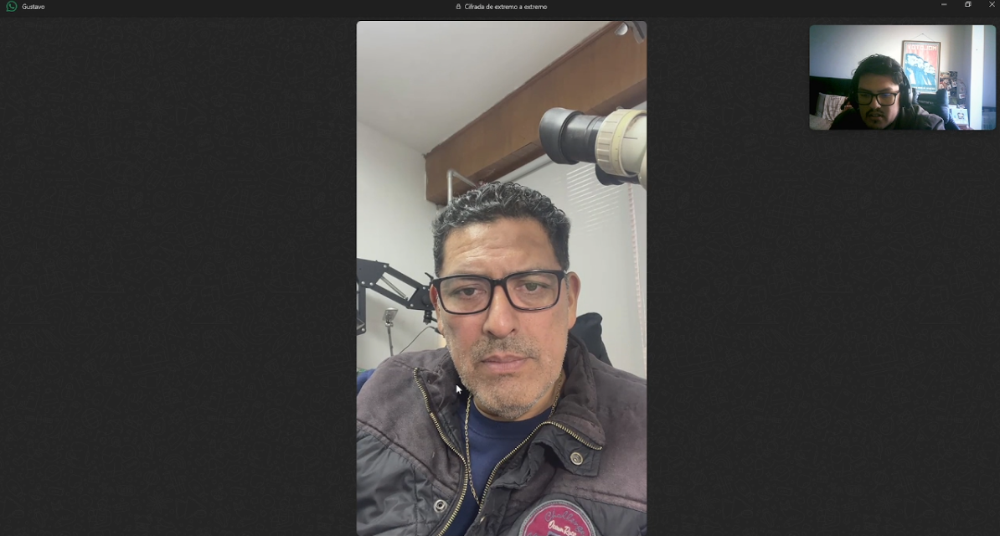

**Nombre y Apellido:** Gustavo Martín Rentería Rosas

**Edad:** 54 años

**Distrito:** Chorrillos

**Nombre del taller/joyeria:** Rentería Joyeros

#### ¿Podrías describir tu taller de joyería y las operaciones diarias que realizas?
El taller se dedica a la elaboración de una joya. Es decir, todo el proceso desde la elaboración hasta el producto final. Lo que pasa por el joyero, el engastador que pone las piedras y los último detalles que son los pulidos, limpieza, baños y de ahí sale el producto final.

#### ¿Cuáles son los principales desafíos que enfrentas en la gestión de la producción de joyas?
Las nuevas tecnologías, se necesita nuevas tencologías para la rapidez. También el control de lo que se da a los joyeros y los productos que se usan. Es un poco más a la antigua, se necesita un programa que nos ayude agilizar ello.

#### ¿Cómo llevas el control de los materiales y recursos necesarios para la producción?
Es una manera más artesanal y manual. O sea, con cuadernos y compramos lo que necesitamos todo en un estante. No se lleva un control de inventario en sí, sino más personalizado.

#### ¿Qué importancia tiene para ti el monitoreo en tiempo real de los procesos de producción?
Tiene suma importancia porque uno puede ver en qué se demora determinado proceso y el por qué se está demorando. Puede ser por el personal o insumo que influye en muchos factores.

#### ¿Cómo gestionas la comunicación interna en tu taller, especialmente entre engastadores, joyeros y secretarios?
A traves es de una persona que mira toda la gestión antes que revisa qué es lo que se entrega, oro, plata, etc. De eso pasa al joyero y del joyero al engastador. Pero todo es oral.

#### ¿Qué beneficios esperas obtener con la implementación de una solución de software especializada en la gestión de procesos de producción y manejo de inventarios?
Mayor rapidez en el control de inventario de material oro o plata y saber con qué cantidad cuento para futuros trabajos o pedidos. 
Mayor exactitud, control y seguridad de las hechuras o trabajos por realizar de los joyeros.
Control de guías de pedido y orden de prioridad para los clientes.
Un mayor control y rapidez para obtener los pesos, merma y costos de un producto final.

#### ¿Qué dispositivos utilizas normalmente para gestionar las operaciones del taller?
No se utiliza nada tecnológico. Sino que uno pasa a ver si todo va bien y con cámaras, pero sólo hasta ahí. Pero no se sabe si demora o no.

### Entrevista #2 (Inicio: 10:10, Fin: 13:50)

**Nombre y Apellido:** Paolo Carrillo  

**Edad:** 23 años  

**Distrito:** San Isidro  

**Nombre del taller/joyería:** El Dorado  

#### ¿Podrías describir tu taller de joyería y las operaciones diarias que realizas?
Mi taller, se dedica a la creación de joyas personalizadas, desde anillos de compromiso hasta piezas exclusivas para clientes particulares. Las operaciones diarias incluyen el diseño, fundición, engastado de piedras, pulido y control de calidad. Contamos con un equipo de artesanos experimentados que se encargan de cada etapa del proceso.

#### ¿Cuáles son los principales desafíos que enfrentas en la gestión de la producción de joyas?

Uno de los mayores desafíos es el control preciso del inventario, especialmente cuando se trata de materiales valiosos como oro y piedras preciosas. Además, la coordinación entre los distintos procesos puede ser complicada, y cualquier error en una etapa puede afectar la calidad del producto final.

#### ¿Cómo llevas el control de los materiales y recursos necesarios para la producción?

Llevo el control de materiales de manera manual, registrando entradas y salidas en un libro físico. Esto requiere mucha atención al detalle para evitar pérdidas o mal uso de los recursos.

#### ¿Qué importancia tiene para ti el monitoreo en tiempo real de los procesos de producción?
El monitoreo en tiempo real es fundamental para identificar y corregir cualquier problema que surja durante la producción. Esto ayuda a minimizar errores y garantiza que los plazos se cumplan.

#### ¿Cómo gestionas la comunicación interna en tu taller, especialmente entre engastadores, joyeros y secretarios?
La comunicación se gestiona principalmente a través de reuniones diarias y un grupo de WhatsApp donde se coordinan las tareas. Sin embargo, a veces la información se pierde o no llega a todos a tiempo.

#### ¿Qué beneficios esperas obtener con la implementación de una solución de software especializada en la gestión de procesos de producción y manejo de inventarios?

Espero que un software especializado me ayude a gestionar mejor el inventario, automatizar procesos y mejorar la comunicación interna. Además, sería ideal contar con herramientas que permitan el monitoreo en tiempo real y la generación de reportes detallados.

#### ¿Qué dispositivos utilizas normalmente para gestionar las operaciones del taller?
Principalmente utilizo una computadora de escritorio y, ocasionalmente, mi smartphone para revisar correos o mensajes urgentes.

#### ¿Cómo te informas sobre nuevas tecnologías o herramientas en la industria de la joyería?
Me informo sobre nuevas tecnologías a través de revistas especializadas, ferias de joyería, y recomendaciones de colegas en la industria. También investigo en internet y participo en grupos de redes sociales dedicados al sector.

### Entrevista #3 (Inicio: 13:50, Fin: 16:36)

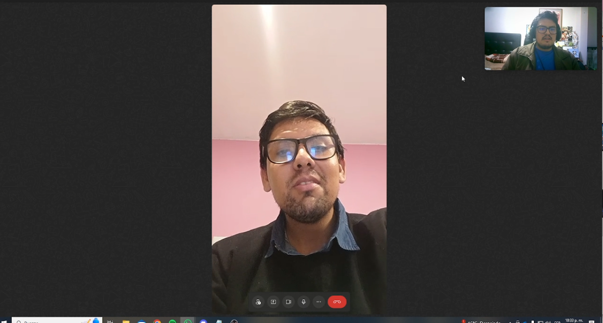

**Nombre y Apellido:** Juan Carlos Cabrera  

**Edad:** 29 años  

**Distrito:** San Isidro  

**Nombre del taller/joyería:** Ñeñis  

#### ¿Podrías describir tu taller de joyería y las operaciones diarias que realizas?
Mi taller es pequeño y nos enfocamos en la creación de piezas personalizadas. Diariamente superviso el diseño, el moldeado y el engaste.

#### ¿Cuáles son los principales desafíos que enfrentas en la gestión de la producción de joyas?
El mayor reto es coordinar todas las etapas sin retrasos y mantener la calidad sin comprometer los tiempos de entrega.

#### ¿Cómo llevas el control de los materiales y recursos necesarios para la producción?
Usamos excel para inventario, pero puede ser difícil mantener todo actualizado.

#### ¿Qué importancia tiene para ti el monitoreo en tiempo real de los procesos de producción?
Es clave para evitar retrasos y saber exactamente en qué etapa está cada pieza.

#### ¿Cómo gestionas la comunicación interna en tu taller, especialmente entre engastadores, joyeros y secretarios?
Nos comunicamos principalmente de manera verbal y por mensajes, pero puede ser desorganizado a veces.

#### ¿Qué beneficios esperas obtener con la implementación de una solución de software especializada en la gestión de procesos de producción y manejo de inventarios?
Espero tener un mejor control del flujo de trabajo, evitar errores y gestionar mejor los materiales.

#### ¿Qué dispositivos utilizas normalmente para gestionar las operaciones del taller?
Principalmente usamos computadoras y, ocasionalmente, teléfonos.

#### ¿Cómo te informas sobre nuevas tecnologías o herramientas en la industria de la joyería?
Investigo en internet y a veces asisto a ferias de joyería.

## Entrevista a Propietario de Joyería

### Entrevista #1 (Inicio: 16:36, Fin: 22:56)

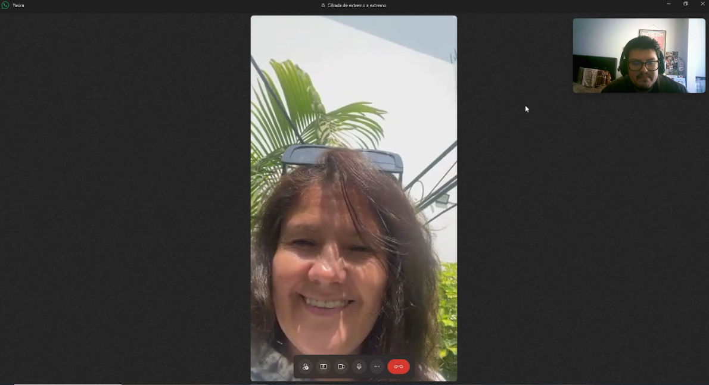

**Nombre y Apellido:** Yasira Palacios Absi

**Edad:** 50

**Distrito:** Chorrillos

**Nombre del taller/joyería:** RENPAL

#### ¿Cómo describes la operación diaria de tu joyería?
La operación diaria de mi joyería implica gestionar el inventario de productos, atender a los clientes, coordinar con proveedores y, en ocasiones, supervisar la producción de piezas personalizadas. Es un proceso que requiere atención constante y una gestión eficiente para mantener la calidad y satisfacer a los clientes.

#### ¿Cómo gestionas el inventario de productos en tu joyería?

Actualmente, la gestión del inventario es un desafío. Utilizamos un sistema manual combinado con hojas de cálculo, lo que a veces resulta en errores y dificulta tener una visión actualizada en tiempo real de nuestro stock.

#### ¿Qué herramientas digitales o tecnológicas utilizas actualmente para gestionar tu negocio?
Usamos algunas herramientas digitales básicas como hojas de cálculo y un software de punto de venta, pero no tenemos una solución integral que cubra todos los aspectos de la gestión del negocio.

#### ¿Cómo controlas la calidad del producto que vendes, especialmente si trabajas con talleres externos?
El control de calidad es crucial. Para productos de talleres externos, realizamos inspecciones visuales y pruebas de calidad al recibir las piezas. Sin embargo, no tenemos un sistema estandarizado para rastrear y documentar este proceso.

#### ¿Cómo manejas la comunicación con los proveedores y fabricantes de joyas?
La comunicación con proveedores y fabricantes se realiza principalmente por teléfono y correo electrónico, lo que a veces puede llevar a malentendidos o retrasos en la información.

#### ¿Qué importancia le das a tener un inventario actualizado y preciso?
Tener un inventario actualizado y preciso es extremadamente importante. Nos ayuda a evitar pérdidas, mejorar el servicio al cliente y tomar decisiones informadas sobre reabastecimiento y nuevas adquisiciones.

#### ¿Cómo te adaptas a las demandas y tendencias cambiantes en el mercado de la joyería?
Nos mantenemos al tanto de las tendencias a través de ferias comerciales, revistas especializadas y feedback de los clientes. Ajustamos nuestro inventario según estas tendencias, aunque a veces es difícil hacerlo de manera ágil.

#### ¿Cuáles son las expectativas de tus clientes en cuanto a la disponibilidad y personalización de productos?
Nuestros clientes esperan una amplia variedad de productos disponibles y la posibilidad de personalizar piezas. Satisfacer estas expectativas requiere una gestión eficiente del inventario y una buena comunicación con los talleres.

#### ¿Cómo valoras la posibilidad de monitorear en tiempo real el estado del inventario y las ventas?
La posibilidad de monitorear en tiempo real el inventario y las ventas sería extremadamente valiosa. Nos permitiría tomar decisiones más informadas y responder rápidamente a las demandas del mercado.

#### ¿Qué beneficios esperas obtener con una solución de software especializada como GemZ para la gestión de inventarios y procesos?
Con una solución como GemZ, esperaría mejorar la eficiencia operativa, reducir errores en la gestión del inventario, mejorar la comunicación con los talleres y proveedores, y en última instancia, aumentar la satisfacción del cliente y las ventas.

#### ¿Qué dispositivos prefieres utilizar para gestionar tu joyería?
Prefiero utilizar tanto computadoras de escritorio como dispositivos móviles para gestionar la joyería. La flexibilidad de acceder a la información desde cualquier lugar sería muy beneficiosa.

#### ¿Qué influencias o fuentes de información consideras al tomar decisiones sobre la adopción de nuevas tecnologías?
Al considerar nuevas tecnologías, me baso en recomendaciones de colegas del sector, opiniones de expertos en tecnología para joyerías, y demostraciones prácticas de cómo la solución puede mejorar específicamente nuestras operaciones diarias.

### Entrevista #2 (Inicio: 22:56, Fin: 28:21)

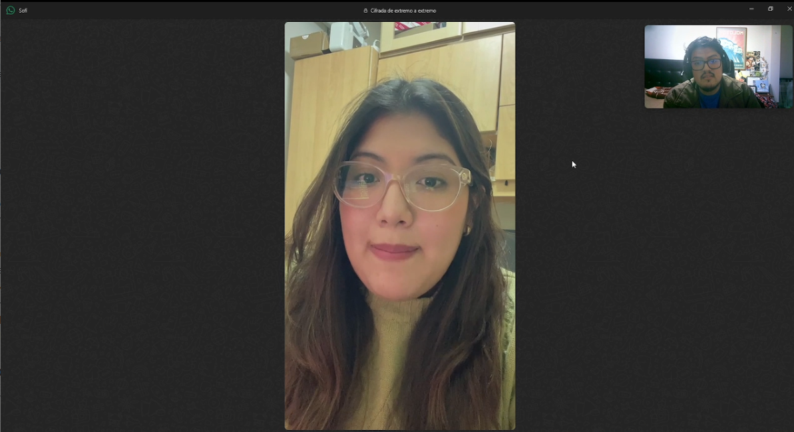

**Nombre y Apellido:** Ana Sofia Espinoza 

**Edad:** 27

**Distrito:** Callao

**Nombre del taller/joyería:** Espinoza

#### ¿Cómo gestionas el inventario de productos en tu joyería?
Mantengo un registro detallado de cada pieza, incluyendo su descripción, precio, materiales y ubicación en la tienda. Realizo conteos físicos regularmente para asegurar la precisión.

#### ¿Qué herramientas digitales o tecnológicas utilizas actualmente para gestionar tu negocio?
Actualmente uso un sistema de punto de venta básico para registrar ventas. También utilizo redes sociales para marketing.

#### ¿Cómo controlas la calidad del producto que vendes, especialmente si trabajas con talleres externos?
Inspecciono personalmente cada pieza que ingresa a la tienda, sea de producción propia o de talleres externos. Mantengo relaciones cercanas con artesanos de confianza.

#### ¿Cómo manejas la comunicación con los proveedores y fabricantes de joyas?
La mayoría de la comunicación es por correo electrónico y llamadas telefónicas. Ocasionalmente realizo visitas personales a proveedores clave.

#### ¿Qué importancia le das a tener un inventario actualizado y preciso?
Es crucial. Un inventario preciso me permite tomar decisiones informadas sobre compras, evitar faltantes y ofrecer un mejor servicio al cliente.

#### ¿Cómo te adaptas a las demandas y tendencias cambiantes en el mercado de la joyería?
Sigo de cerca las tendencias en redes sociales, revistas especializadas y ferias del sector. Ajusto mi inventario gradualmente, manteniendo un balance entre piezas clásicas y modernas.

#### ¿Cuáles son las expectativas de tus clientes en cuanto a la disponibilidad y personalización de productos?
Mis clientes esperan encontrar piezas únicas y la posibilidad de personalizar diseños. La disponibilidad inmediata es importante, pero están dispuestos a esperar por piezas especiales.

#### ¿Cómo valoras la posibilidad de monitorear en tiempo real el estado del inventario y las ventas?
Sería muy valioso. Me permitiría tomar decisiones más rápidas y mejorar el servicio al cliente, especialmente en temporadas altas.

#### ¿Qué beneficios esperas obtener con una solución de software especializada como GemZ para la gestión de inventarios y procesos?
Espero que un software como GemZ me ayude a optimizar el inventario, mejorar la trazabilidad de las piezas, facilitar la generación de reportes y, en general, ahorrar tiempo en tareas administrativas.

#### ¿Qué dispositivos prefieres utilizar para gestionar tu joyería?
Prefiero usar una combinación de computadora en la tienda y una tablet para cuando estoy en movimiento o atendiendo clientes en el piso de ventas.

#### ¿Qué influencias o fuentes de información consideras al tomar decisiones sobre la adopción de nuevas tecnologías?
Me baso en recomendaciones e información de asociaciones de joyeros. También valoro mucho la experiencia de otros negocios similares al mío.

### Entrevista #3 (Inicio: 28:21, Fin: 32:43)

**Nombre y Apellido:** Milagros Ospina

**Edad:** 29

**Distrito:** Chorrillos

**Nombre del taller/joyería:** Joyería Ospinas

#### ¿Cómo describes la operación diaria de tu joyería?
La operación diaria de una joyería incluye la atención al cliente, gestión del inventario, supervisión de ventas, y coordinación con talleres y proveedores. Es esencial mantener una tienda organizada y atractiva para los clientes.

#### ¿Cómo gestionas el inventario de productos en tu joyería?
El inventario se gestiona mediante un sistema que permite el seguimiento de entradas y salidas de productos, asegurando que siempre haya suficiente stock de los artículos más vendidos.

#### ¿Qué herramientas digitales o tecnológicas utilizas actualmente para gestionar tu negocio?
Actualmente, se utilizan software de gestión, sistemas POS (puntos de venta) y plataformas en línea para facilitar las ventas y el seguimiento del inventario.

#### ¿Cómo controlas la calidad del producto que vendes, especialmente si trabajas con talleres externos?
Para controlar la calidad, especialmente con talleres externos, se establecen criterios claros y se realizan inspecciones regulares de los productos antes de que lleguen al cliente.

#### ¿Cómo manejas la comunicación con los proveedores y fabricantes de joyas?
La comunicación con proveedores se maneja a través de correos electrónicos, llamadas telefónicas y, en algunos casos, plataformas digitales que permiten un seguimiento más detallado de los pedidos.

#### ¿Qué importancia le das a tener un inventario actualizado y preciso?
Un inventario preciso es crucial para evitar pérdidas, asegurar la disponibilidad de productos y mejorar la satisfacción del cliente.

#### ¿Cómo te adaptas a las demandas y tendencias cambiantes en el mercado de la joyería?
Para adaptarse a las tendencias, se realiza un análisis constante del mercado y se actualiza el catálogo de productos en consecuencia.

#### ¿Cuáles son las expectativas de tus clientes en cuanto a la disponibilidad y personalización de productos?
Los clientes esperan una amplia variedad de productos disponibles y opciones de personalización para satisfacer sus preferencias únicas.

#### ¿Cómo valoras la posibilidad de monitorear en tiempo real el estado del inventario y las ventas?
Monitorear el inventario y las ventas en tiempo real permite tomar decisiones rápidas y efectivas, mejorando la eficiencia del negocio.

#### ¿Qué beneficios esperas obtener con una solución de software especializada como GemZ para la gestión de inventarios y procesos?
Con una solución como GemZ, se espera mejorar la precisión del inventario, optimizar procesos, y facilitar la toma de decisiones basadas en datos.

#### ¿Qué dispositivos prefieres utilizar para gestionar tu joyería?
Se prefieren dispositivos como computadoras, tablets y smartphones para gestionar las operaciones diarias de la joyería.

#### ¿Qué influencias o fuentes de información consideras al tomar decisiones sobre la adopción de nuevas tecnologías?
Las decisiones sobre nuevas tecnologías se basan en tendencias del sector, recomendaciones de colegas, y análisis de costo-beneficio.

## 2.2.3. Análisis de entrevistas.

# Análisis de Entrevistas por Segmento Objetivo

## 1. Segmento: Dueños de Joyería

### Características Objetivas y Subjetivas

| Característica                        | Descripción                                                                 | % de Entrevistados | Ejemplos de Entrevistas                                                                                               |
|---------------------------------------|-----------------------------------------------------------------------------|-------------------|-----------------------------------------------------------------------------------------------------------------------|
| **Operación diaria**                  | Gestión de inventario, atención a clientes, coordinación con proveedores     | 100%               | "La operación diaria de mi joyería implica gestionar el inventario de productos, atender a los clientes..." (Yasira Palacios) |
| **Gestión de inventario**             | Uso de hojas de cálculo y sistemas manuales, con desafíos de precisión       | 66%                | "La gestión del inventario es un desafío. Utilizamos un sistema manual combinado con hojas de cálculo..." (Yasira Palacios)  |
| **Herramientas digitales**            | Uso de software de punto de venta (POS) y hojas de cálculo                   | 100%               | "Actualmente se utilizan software de gestión, sistemas POS y plataformas en línea..." (Milagros Ospina)                 |
| **Control de calidad**                | Inspecciones visuales, pruebas al recibir piezas de talleres externos        | 100%               | "Realizamos inspecciones visuales y pruebas de calidad al recibir las piezas..." (Yasira Palacios)                     |
| **Comunicación con proveedores**      | Principalmente vía telefónica y por correo electrónico                       | 100%               | "La comunicación con proveedores se realiza principalmente por teléfono y correo electrónico..." (Yasira Palacios)     |
| **Monitoreo en tiempo real**          | Valoran la posibilidad de monitoreo en tiempo real para inventarios y ventas | 100%               | "Monitorear el inventario y las ventas en tiempo real sería extremadamente valioso..." (Milagros Ospina)              |
| **Personalización de productos**      | Clientes esperan personalización y disponibilidad inmediata de productos     | 100%               | "Los clientes esperan una amplia variedad de productos disponibles y opciones de personalización..." (Yasira Palacios)  |

### Análisis
- **Gestión del inventario**: La mayoría de los entrevistados (66%) gestiona el inventario de forma manual, lo que les genera dificultades en términos de precisión y actualización.
- **Herramientas tecnológicas**: Aunque todos los dueños de joyería usan herramientas digitales básicas (100%), ninguno cuenta con una solución integral que les permita gestionar todos los aspectos de su negocio.
- **Personalización**: La demanda por productos personalizados es alta, siendo un requisito clave para la satisfacción del cliente.

---

## 2. Segmento: Dueños de Talleres de Joyería

### Características Objetivas y Subjetivas

| Característica                        | Descripción                                                                 | % de Entrevistados | Ejemplos de Entrevistas                                                                                              |
|---------------------------------------|-----------------------------------------------------------------------------|-------------------|-----------------------------------------------------------------------------------------------------------------------|
| **Operación diaria**                  | Elaboración completa de joyas, desde el diseño hasta el producto final       | 100%               | "El taller se dedica a la elaboración de una joya, todo el proceso desde la elaboración hasta el producto final..." (Gustavo Martín) |
| **Gestión de materiales**             | Control manual de materiales, uso de cuadernos y registros físicos           | 66%                | "Es una manera más artesanal y manual... no se lleva un control de inventario en sí..." (Gustavo Martín)               |
| **Monitoreo de procesos**             | Alta necesidad de monitoreo en tiempo real para optimizar la producción      | 100%               | "El monitoreo en tiempo real es fundamental para identificar y corregir cualquier problema..." (Paolo Carrillo)        |
| **Comunicación interna**              | Comunicación verbal y a través de reuniones diarias o grupos de mensajería   | 66%                | "La comunicación se gestiona principalmente a través de reuniones diarias y un grupo de WhatsApp..." (Paolo Carrillo)  |
| **Control de calidad**                | Supervisión interna de cada etapa del proceso de producción                  | 100%               | "Diariamente superviso el diseño, el moldeado y el engaste..." (Juan Carlos Cabrera)                                  |
| **Tecnología utilizada**              | Uso limitado de tecnología, predomina el uso de computadoras                | 66%                | "Principalmente usamos computadoras y ocasionalmente teléfonos..." (Juan Carlos Cabrera)                              |

### Análisis
- **Gestión de materiales**: El 66% de los talleres gestionan los materiales de manera manual, lo que representa una oportunidad para implementar soluciones tecnológicas que optimicen este proceso.
- **Monitoreo de procesos**: Todos los entrevistados (100%) valoran el monitoreo en tiempo real como una herramienta clave para mejorar la producción y evitar errores.
- **Comunicación interna**: Si bien algunos talleres utilizan herramientas digitales como grupos de mensajería, el 66% aún depende principalmente de la comunicación verbal o reuniones físicas, lo que puede generar desorganización.

---

### Conclusión General
Ambos segmentos comparten desafíos en la gestión de inventarios y producción. Las herramientas digitales básicas y la falta de soluciones integrales son una característica común, lo que subraya la necesidad de software especializado como GemZ para mejorar la eficiencia y reducir errores.

## 2.3. Needfinding.
## 2.3.1. User Personas.

### Dueño de joyería

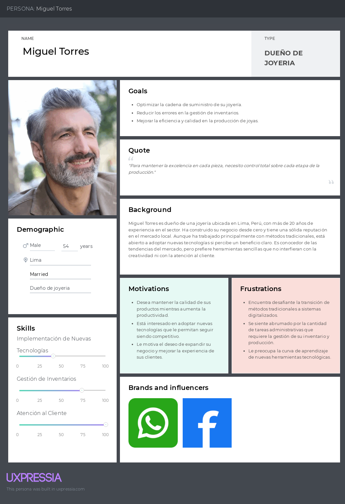

### Dueño de taller de joyería

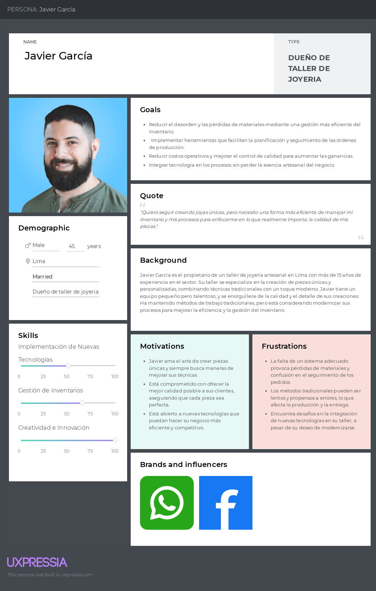

## 2.3.2. User Task Matrix.

| User Task                                  | Dueño de Joyería | ------/-----	 | Dueño de Taller de Joyería | ------/-----	 |
|---------------------------------------------------|------------------|-----------------|----------------------------|----------------------------|
|                                                   | **Frecuencia**   | **Importancia** | **Frecuencia**             | **Importancia**            |
| **Gestionar las operaciones diarias de la tienda**| Alta             | Alta            |                            |                            |
| **Gestión de inventario**                         | Alta             | Alta            | Media                      | Alta                       |
| **Comunicación con proveedores**                  |                  |                 | Alta                       | Alta                       |
| **Control de calidad de los productos**           | Alta             | Alta            | Alta                       | Alta                       |
| **Adaptación a las tendencias del mercado**       | Media            | Alta            |                            |                            |
| **Seguimiento del proceso de producción**         |                  |                 | Alta                       | Alta                       |
| **Monitoreo en tiempo real del inventario**       | Alta             | Alta            | Alta                       | Alta                       |
| **Interacción con clientes y ventas**             | Alta             | Alta            |                            |                            |
| **Adopción e integración de tecnología**          | Media            | Alta            | Media                      | Alta                       |
| **Gestión de órdenes y trabajo**                  |                  |                 | Alta                       | Alta                       |
| **Personalización de productos**                  | Media            | Alta            | Alta                       | Alta                       |
| **Uso de software para mejorar la eficiencia**    | Media            | Alta            | Media                      | Alta                       |
| **Actividades de marketing y promoción**          | Alta             | Alta            |                            |                            |
## 2.3.3. User Journey Mapping.

### Dueño de joyería

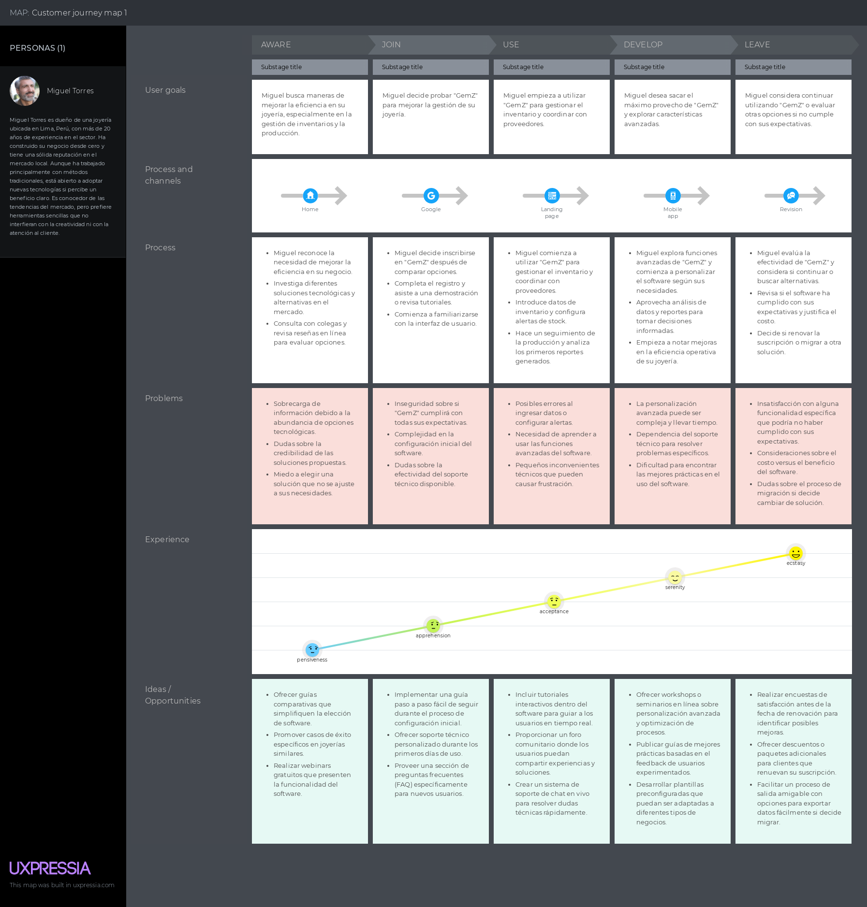

### Dueño de taller de joyería

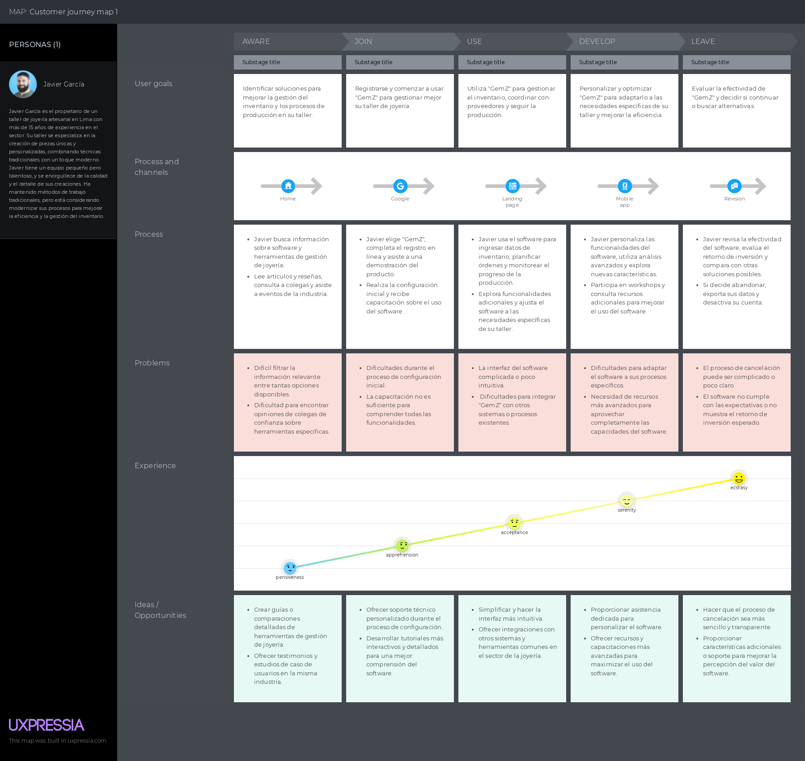

## 2.3.4. Empathy Mapping.

### Dueño de joyería

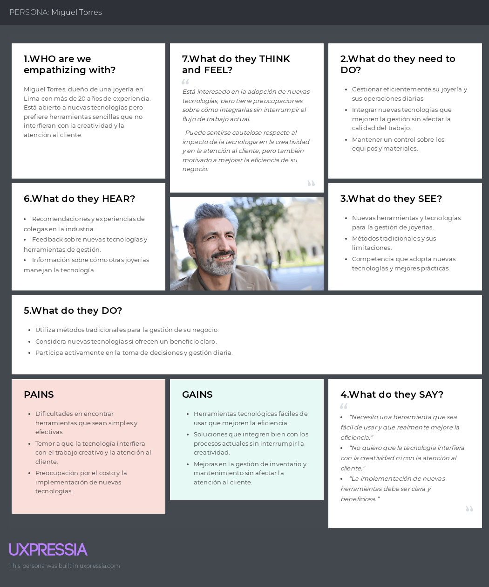

### Dueño de taller de joyería

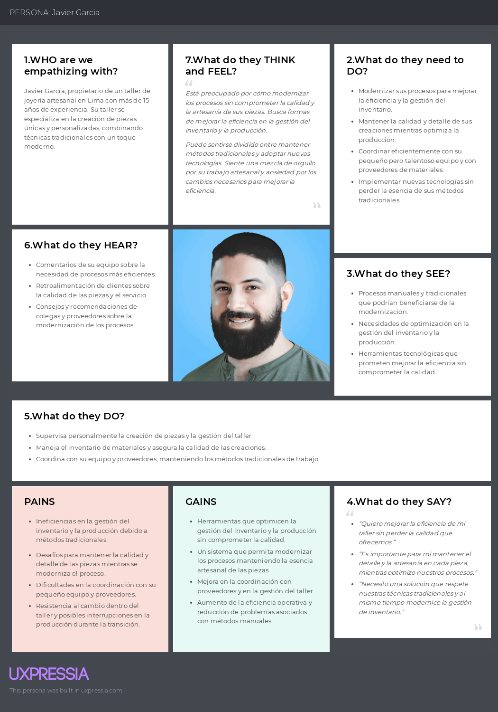

## 2.3.5. As-is Scenario Mapping.

### Dueño de joyería

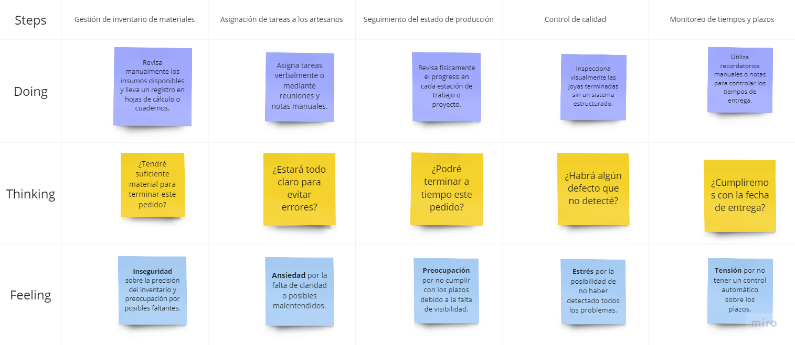

### Dueño de taller de joyería

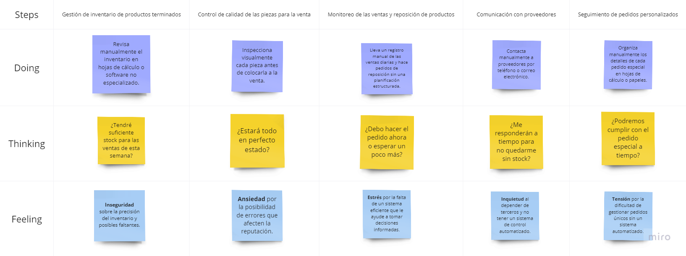

## 2.4. Ubiquitous Language.

El "Lenguaje Ubicuo" es clave para implementar GemZ. Nos permite establecer un idioma común entre el equipo de desarrollo y los usuarios, lo que facilita la comunicación y la comprensión de los conceptos esenciales en la gestión de procesos e inventarios en la industria de la joyería.

Taller de Joyería: Es el lugar donde se realizan todas las etapas de la producción de joyas, desde el diseño hasta la entrega del producto final. Los dueños de talleres pueden usar GemZ para gestionar y optimizar cada paso del proceso.

Joyería: Un negocio que se dedica a vender joyas, con o sin taller propio. Los propietarios de joyerías pueden utilizar GemZ para gestionar eficientemente su inventario y asegurarse de que las piezas estén siempre disponibles para la venta.

Proceso de Producción: Incluye todas las fases para crear una joya, como la adquisición de materiales, el diseño, el engaste, la limpieza y el pulido. Con GemZ, es posible controlar cada paso en tiempo real, garantizando una producción eficiente y de alta calidad.

Inventario de Insumos: Aquí se agrupan todos los materiales necesarios para la producción de joyas, como metales preciosos, piedras y otros componentes. GemZ ayuda a mantener este inventario actualizado, evitando interrupciones en la producción.

Inventario de Productos Terminados: Se refiere a las joyas que ya están listas para la venta. GemZ facilita la organización y seguimiento de este inventario, asegurando que las joyas estén disponibles según la demanda.

Orden de Trabajo: Es un registro en GemZ que detalla las especificaciones de la joya que se va a producir, incluyendo materiales, diseño y plazos de entrega. Esto asegura que todas las etapas del proceso estén alineadas con lo que el cliente espera.

Engaste: Técnica para fijar piedras preciosas en una joya, garantizando que queden seguras y estéticas. GemZ permite documentar y seguir este proceso, asegurando que el trabajo sea preciso y de calidad.

Pulido: Es la última etapa en la producción de una joya, donde se limpia y se pule para darle un acabado brillante. GemZ facilita la gestión de esta fase, asegurando que cada pieza quede perfecta.

Monitoreo en Tiempo Real: GemZ ofrece una visión en vivo del estado de los procesos de producción e inventario, lo que permite a los dueños de talleres y joyerías tomar decisiones informadas al instante.

Reporte de Producción: Este informe generado por GemZ muestra el estado actual de la producción, identifica posibles cuellos de botella y permite hacer ajustes en tiempo real para mantener la eficiencia.

Eficiencia Operativa: Es el objetivo principal de GemZ: optimizar todos los procesos dentro del taller o la joyería, reducir errores, mejorar la calidad y aumentar la productividad.

Modelo de Negocio Sostenible: GemZ apoya un enfoque sostenible al mejorar la eficiencia y reducir desperdicios en la producción y gestión de inventarios, ayudando a los dueños de talleres y joyerías a operar de manera más rentable y amigable con el medio ambiente.

Ejemplo de Implementación: Cuando un dueño de taller inicia una nueva orden de trabajo en GemZ, el sistema actualiza automáticamente el inventario de insumos y permite el monitoreo en tiempo real del proceso de producción, incluyendo el engaste y el pulido. Esto garantiza que todos los materiales estén disponibles y que la producción avance sin problemas. Por su parte, los dueños de joyerías pueden consultar el inventario de productos terminados para planificar mejor sus ventas y reposiciones de stock.
