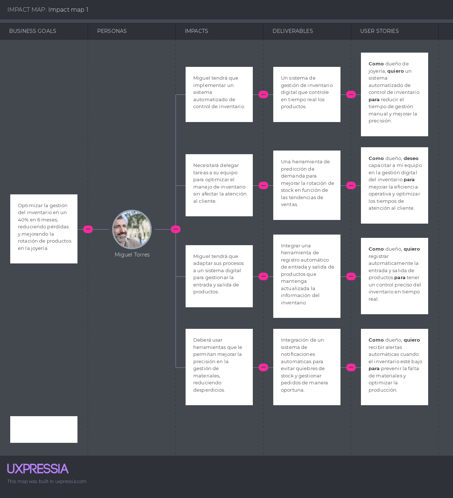
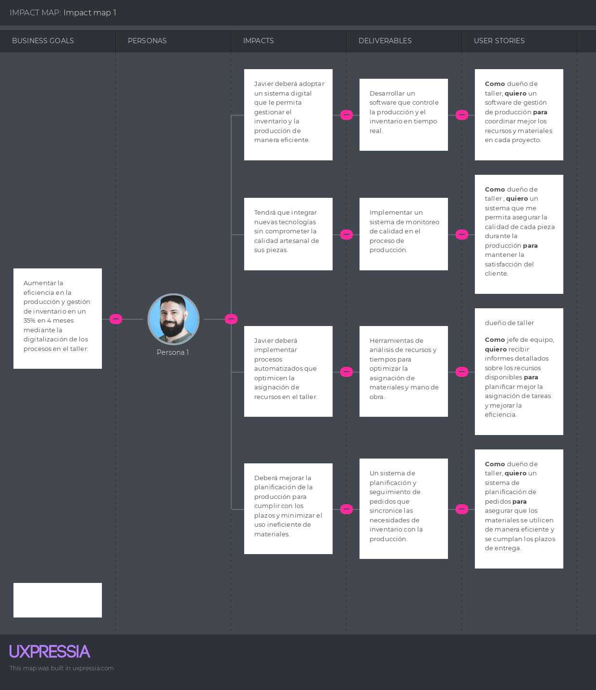

# **Capítulo III: Requirements Specification**
## 3.1. To-Be Scenario Mapping.

## To-Be del segmento objetivo dueño de taller de joyeria
<td></td>

## To-Be del segmento objetivo dueño de joyeria
<td></td>

## 3.2. User Stories.

| ID de Historia de Usuario | Título de User Story              | Descripción                                                                                                       | Criterios de Aceptación con Escenarios                                                                                                                                                                                                                                                                                                                                                                                                                                                                                                                                                                                                                                                                                                                                                                                                                                | ID de Épica |
|---------------------------|----------------------------------|---------------------------------------------------------------------------------------------------------------------|-----------------------------------------------------------------------------------------------------------------------------------------------------------------------------------------------------------------------------------------------------------------------------------------------------------------------------------------------------------------------------------------------------------------------------------------------------------------------------------------------------------------------------------------------------------------------------------------------------------------------------------------------------------------------------------------------------------------------------------------------------------------------------------------------------------------------------------------------------------------------|-------------|
| US001 | Iniciar sesión | Como usuario registrado, quiero poder acceder a la plataforma mediante un inicio de sesión, para gestionar mi cuenta y aprovechar todas las funcionalidades disponibles. | **Happy Path:** **Dado** que el usuario posee credenciales correctas. **Cuando** el usuario introduce sus credenciales correctas y pulsa "Acceder".  **Unhappy Path:** **Dado** que el usuario tiene credenciales incorrectas. **Cuando** el usuario introduce credenciales incorrectas y pulsa "Acceder".  **Unhappy Path:** **Dado** que el usuario no está registrado. **Cuando** el usuario intenta iniciar sesión sin tener una cuenta. **Entonces** el sistema muestra un mensaje de error e incluye un enlace para registrarse. | - |
| US002 | Recuperar Contraseña | Como usuario de la plataforma, Quiero poder recuperar mi contraseña olvidada, Para poder acceder nuevamente a mi cuenta. | **Happy Path:** **Dado** que el usuario ha olvidado su contraseña. **Cuando** el usuario solicita restablecer la contraseña. **Entonces** el sistema envía un correo electrónico con un enlace de restablecimiento. **Unhappy Path:** **Dado** que el usuario no ha olvidado su contraseña. **Cuando** el usuario intenta restablecerla sin haber olvidado la contraseña. **Entonces** el sistema muestra un mensaje indicando que la contraseña es incorrecta. **Unhappy Path:** **Dado** que el usuario no tiene una cuenta. **Cuando** el usuario intenta restablecer la contraseña sin estar registrado. **Entonces** el sistema muestra un mensaje indicando que la cuenta no existe. | - |
| US003 | Modificar Datos Personales | Como usuario registrado, Quiero poder modificar mis datos personales en mi perfil, Para asegurar que estén siempre correctos y actualizados. | **Happy Path:** **Dado** que el usuario desea modificar su información personal. **Cuando** el usuario realiza cambios en su perfil y guarda. **Entonces** el sistema actualiza los datos en la base de datos. **Unhappy Path:** **Dado** que el usuario intenta guardar información incorrecta. **Cuando** el usuario intenta guardar cambios dejando campos obligatorios vacíos. **Entonces** el sistema muestra un mensaje indicando los campos que son obligatorios. **Unhappy Path:** **Dado** que el usuario quiere eliminar su foto de perfil. **Cuando** el usuario elimina la foto y guarda los cambios. **Entonces** el sistema borra la foto de perfil y actualiza los datos en la base de datos. | - |
| US004 | Modificar el Idioma de la Plataforma | Como usuario, Quiero poder cambiar el idioma de la plataforma, Para utilizarla en mi idioma preferido. | **Happy Path:** **Dado** que el usuario desea cambiar el idioma de la plataforma. **Cuando** el usuario selecciona un nuevo idioma en la configuración. **Entonces** la plataforma muestra el contenido en el idioma seleccionado. **Unhappy Path:** **Dado** que el usuario selecciona el mismo idioma actual. **Cuando** el usuario intenta cambiar el idioma a uno que ya está configurado. **Entonces** la plataforma no realiza ningún cambio y muestra un mensaje informativo. **Unhappy Path:** **Dado** que el usuario selecciona un idioma no soportado. **Cuando** el usuario intenta cambiar el idioma a uno no admitido por la plataforma. Entonces la plataforma no realiza cambios y muestra un mensaje de error. | - |
| US005 | Gestión de Stock de Materiales | Como dueño de una joyería o taller, Quiero poder gestionar el inventario de materiales en tiempo real, Para asegurarme de que siempre tenga los insumos necesarios para la producción sin generar excesos o faltantes. | **Happy Path:** **Dado** que el usuario necesita gestionar su inventario de materiales. **Cuando** el usuario agrega, actualiza o elimina información del inventario. **Entonces** el sistema actualiza el stock en tiempo real y genera alertas automáticas si un material está por agotarse. **Unhappy Path:** **Dado** que el usuario intenta actualizar el inventario con información incorrecta o incompleta. Cuando el usuario intenta guardar cambios sin cumplir con los campos obligatorios. **Entonces** el sistema muestra un mensaje indicando los errores y solicita corregir la información antes de guardar. | - |
| US006 | Generación de Reportes de Inventario | Como dueño de una joyería o taller, Quiero poder generar reportes detallados del inventario, Para analizar el estado de los materiales, identificar tendencias y tomar decisiones informadas sobre compras y producción. | **Happy Path:** **Dado** que el usuario necesita un reporte del inventario. **Cuando** el usuario solicita la generación de un reporte en la sección de informes del sistema. **Entonces** el sistema genera un reporte detallado con información sobre los niveles de stock, materiales más utilizados, y alertas de bajo stock, y permite exportar el reporte en formatos como PDF o Excel. **Unhappy Path:** Dado que el usuario solicita un reporte con parámetros incorrectos o incompletos. **Cuando** el usuario intenta generar el reporte sin seleccionar los filtros adecuados o con parámetros inválidos. **Entonces** el sistema muestra un mensaje indicando los errores y solicita corregir la información antes de generar el reporte. **Unhappy Path:** **Dado** que el usuario no tiene permisos para generar reportes. **Cuando** el usuario intenta acceder a la sección de generación de reportes sin los permisos necesarios. **Entonces** el sistema muestra un mensaje de acceso denegado y ofrece opciones para solicitar permisos o contactar con el administrador del sistema. | - |
| US007 | Notificación de Reabastecimiento | Como dueño de una joyería o taller, Quiero recibir notificaciones automáticas cuando los niveles de ciertos materiales lleguen a un umbral crítico, Para poder reabastecer los materiales a tiempo y evitar interrupciones en la producción. | **Happy Path:** **Dado** que el usuario ha configurado umbrales de reabastecimiento para los materiales. **Cuando** el nivel de un material alcanza el umbral crítico definido. **Entonces** el sistema envía una notificación automática por correo electrónico o a través de la aplicación, alertando al usuario sobre la necesidad de reabastecimiento. **Unhappy Path:** **Dado** que el usuario no ha configurado umbrales de reabastecimiento para los materiales. **Cuando** el nivel de un material alcanza un punto crítico y no hay una configuración previa. **Entonces** el sistema no envía ninguna notificación y muestra un mensaje recordatorio para configurar los umbrales de reabastecimiento. **Unhappy Path:** **Dado** que el usuario recibe notificaciones incorrectas debido a errores en los umbrales de configuración. **Cuando** el sistema envía notificaciones para materiales que no están realmente cerca del umbral. **Entonces** el sistema proporciona una opción para revisar y corregir la configuración de los umbrales y asegura que las notificaciones sean precisas. | - |
| US008 | Historial de Movimientos de Inventario | Como dueño de una joyería o taller, Quiero tener acceso al historial completo de movimientos de inventario, Para poder revisar las transacciones anteriores, auditar el uso de materiales y detectar posibles inconsistencias o errores. | **Happy Path:** **Dado** que el usuario necesita revisar el historial de movimientos de inventario. **Cuando** el usuario accede a la sección de historial en el sistema. **Entonces** el sistema muestra una lista detallada de todas las transacciones de inventario, incluyendo entradas, salidas y ajustes, con filtros para buscar por fecha, tipo de movimiento o material. **Unhappy Path:** **Dado** que el usuario intenta acceder al historial sin permisos adecuados. **Cuando** el usuario intenta consultar el historial y no tiene los permisos necesarios. **Entonces** el sistema muestra un mensaje de acceso denegado y ofrece opciones para solicitar permisos o contactar con el administrador. **Unhappy Path:** **Dado** que el usuario enfrenta problemas con datos faltantes o inconsistentes en el historial. **Cuando** el usuario revisa el historial y encuentra información incorrecta o incompleta. **Entonces** el sistema permite al usuario reportar inconsistencias y proporciona herramientas para corregir o investigar los datos faltantes. | - |
| US009 | Control de Acceso por Roles | Como dueño de una joyería o taller, Quiero poder asignar distintos niveles de acceso a mi personal basado en sus roles, Para asegurar que cada empleado solo pueda ver y modificar la información que corresponde a sus responsabilidades. | **Happy Path:** **Dado** que el usuario necesita configurar permisos de acceso. **Cuando** el usuario asigna roles y permisos a diferentes miembros del equipo. **Entonces** el sistema aplica los niveles de acceso correspondientes, limitando la visualización y modificación de datos según el rol asignado. **Unhappy Path:** **Dado** que el usuario intenta asignar permisos sin tener los privilegios necesarios. **Cuando** el usuario intenta modificar roles o permisos sin ser administrador. **Entonces** el sistema muestra un mensaje de acceso denegado y sugiere contactar con el administrador del sistema. **Unhappy Path:** **Dado** que un empleado intenta acceder a una sección restringida. **Cuando** el empleado intenta ver o modificar información a la que no tiene acceso. **Entonces** el sistema bloquea el acceso y muestra un mensaje explicativo, manteniendo la seguridad de los datos sensibles. | - |
| US010 | Seguimiento de Producción en Tiempo Real | Como dueño de una joyería o taller, quiero monitorear el proceso de producción en tiempo real, para asegurarme de que los pedidos se estén fabricando según lo planeado y cumplir con los plazos de entrega. | **Happy Path:** **Dado** que el usuario tiene pedidos en producción. **Cuando** el usuario accede a la sección de seguimiento de producción. **Entonces** el sistema muestra el estado actual de cada pedido, con detalles sobre las etapas de producción y el tiempo estimado de finalización. **Unhappy Path:** **Dado** que el sistema no ha actualizado el estado de producción. **Cuando** el usuario intenta revisar el progreso y no encuentra información actualizada. **Entonces** el sistema muestra un mensaje de error y permite al usuario reintentar la actualización o contactar con el soporte técnico. **Unhappy Path:** **Dado** que no hay pedidos activos. **Cuando** el usuario intenta acceder a la sección de seguimiento. **Entonces** el sistema muestra un mensaje informando que no hay pedidos en producción actualmente. | - |
| US011 | Optimización de Producción Basada en Inventario | Como dueño de una joyería o taller, quiero que el sistema sugiera ajustes en la producción basados en el inventario disponible, para evitar retrasos y optimizar el uso de los materiales en stock. | **Happy Path:** **Dado** que el sistema detecta que el inventario disponible es suficiente. **Cuando** el usuario ingresa un nuevo pedido. **Entonces** el sistema sugiere el mejor uso de los materiales en stock para completar el pedido sin necesidad de reabastecer. **Unhappy Path:** **Dado** que el inventario no es suficiente para cumplir con el pedido. **Cuando** el usuario intenta iniciar la producción. **Entonces** el sistema muestra un mensaje indicando los materiales faltantes y sugiere reordenarlos o ajustar la cantidad del pedido. **Unhappy Path:** **Dado** que el sistema hace una sugerencia incorrecta de materiales. **Cuando** el usuario detecta que los materiales sugeridos no son los adecuados. **Entonces** el sistema permite al usuario modificar manualmente las sugerencias y ajustar la producción. | - |
| US012 | Gestión de Proveedores de Materiales | Como dueño de una joyería o taller, quiero gestionar la información de mis proveedores de materiales, para tener un control más eficiente sobre mis compras y reabastecimientos. | **Happy Path:** **Dado** que el usuario desea añadir o actualizar la información de un proveedor. **Cuando** el usuario ingresa los datos del proveedor y guarda los cambios. **Entonces** el sistema actualiza la base de datos con la nueva información del proveedor y muestra una confirmación de éxito. **Unhappy Path:** **Dado** que el usuario intenta guardar información incompleta o incorrecta. **Cuando** el usuario intenta guardar los datos del proveedor. **Entonces** el sistema muestra un mensaje indicando los campos obligatorios y permite al usuario corregir la información. **Unhappy Path:** **Dado** que el usuario intenta eliminar un proveedor que tiene pedidos activos. **Cuando** el usuario intenta eliminar el proveedor. **Entonces** el sistema muestra un mensaje advirtiendo que el proveedor tiene pedidos activos y solicita confirmación antes de proceder con la eliminación. | - |
| US013 | Control de Calidad de Materiales | Como dueño de una joyería o taller, quiero tener un sistema para registrar y controlar la calidad de los materiales que recibo, para asegurarme de que cumplan con los estándares y evitar problemas en la producción. | **Happy Path:** **Dado** que el usuario recibe un nuevo lote de materiales. **Cuando** el usuario registra los detalles del lote y realiza pruebas de calidad. **Entonces** el sistema almacena los resultados de las pruebas y muestra una confirmación de que el lote ha pasado el control de calidad. **Unhappy Path:** **Dado** que el usuario detecta que un lote de materiales no cumple con los estándares de calidad. **Cuando** el usuario registra los resultados negativos en el sistema. **Entonces** el sistema muestra un mensaje indicando que el lote ha fallado el control de calidad y ofrece opciones para gestionar el rechazo o devolución de los materiales. **Unhappy Path:** **Dado** que el usuario intenta registrar los resultados de calidad sin completar todas las pruebas. **Cuando** el usuario intenta guardar los resultados. **Entonces** el sistema muestra un mensaje indicando que se deben completar todas las pruebas antes de guardar. | - |
| US014 | Asignar Tareas a Empleados | Como dueño de una joyería o taller, quiero asignar tareas específicas a los empleados, para asegurarme de que todos los aspectos de la producción y venta se gestionen eficientemente. | **Happy Path:** **Dado** que el usuario accede a la sección de gestión de tareas. **Cuando** el usuario asigna una tarea a un empleado. **Entonces** el sistema notifica al empleado sobre la nueva tarea y actualiza el estado de la tarea en el sistema. **Unhappy Path:** **Dado** que el usuario intenta asignar una tarea a un empleado que ya tiene tareas asignadas. **Cuando** el usuario intenta asignar una nueva tarea a un empleado con una carga de trabajo completa. **Entonces** el sistema muestra un mensaje indicando que el empleado tiene una carga de trabajo alta y sugiere redistribuir las tareas. **Unhappy Path:** **Dado** que el usuario asigna una tarea con detalles incompletos. **Cuando** el usuario guarda una tarea sin especificar todos los detalles. **Entonces** el sistema muestra un mensaje indicando que se deben completar todos los detalles de la tarea. | - |
| US015 | Historial de Mantenimiento de Equipos | Como dueño de una joyería, quiero mantener un registro del mantenimiento de los equipos de producción, para asegurarme de que todos los equipos estén en buen estado y evitar fallos inesperados. | **Happy Path:** **Dado** que el usuario realiza mantenimiento en un equipo. **Cuando** el usuario registra el mantenimiento en el sistema. **Entonces** el sistema actualiza el historial del equipo y muestra la fecha del próximo mantenimiento programado. **Unhappy Path:** **Dado** que el usuario olvida registrar el mantenimiento. **Cuando** el usuario realiza el mantenimiento pero no lo registra. **Entonces** el sistema envía un recordatorio al usuario para registrar el mantenimiento. **Unhappy Path:** **Dado** que el mantenimiento registrado está incompleto. **Cuando** el usuario guarda la entrada con detalles faltantes. **Entonces** el sistema muestra un mensaje indicando los campos faltantes y solicita completar la información. | - |
| US016 | Comunicación entre Joyerías y Talleres | Como dueño de una joyería, quiero tener la capacidad de contactar directamente a los talleres a través de la aplicación, para coordinar detalles sobre la producción y resolver problemas rápidamente. | **Happy Path:** **Dado** que el usuario está en la sección de talleres de la aplicación. **Cuando** el usuario selecciona un taller y elige la opción de contacto. **Entonces** el sistema permite al usuario enviar un mensaje directo al taller y recibir confirmación. **Unhappy Path:** **Dado** que el taller no responde al mensaje. **Cuando** el usuario no recibe una respuesta en un tiempo determinado. **Entonces** el sistema envía una notificación de seguimiento al taller y al dueño de la joyería. **Unhappy Path:** **Dado** que el usuario tiene problemas para enviar el mensaje. **Cuando** el sistema falla al intentar enviar el mensaje. **Entonces** el sistema muestra un mensaje de error y permite al usuario reintentar el envío del mensaje. | - |
| US017 | Control de Accesos al Sistema | Como dueño de un taller de joyería, quiero controlar y gestionar los accesos de los usuarios al sistema, para asegurarme de que solo el personal autorizado pueda acceder a funciones y datos sensibles. | **Happy Path:** **Dado** que el dueño del taller necesita agregar un nuevo usuario. **Cuando**el dueño configura el acceso y los permisos del nuevo usuario en el sistema. **Entonces** el sistema guarda la configuración y el nuevo usuario puede acceder a las funciones según los permisos asignados. **Unhappy Path:** **Dado** que el dueño asigna permisos incorrectos. **Cuando** el usuario intenta acceder a funciones no autorizadas. **Entonces** el sistema muestra un mensaje de error indicando que el usuario no tiene los permisos necesarios. **Unhappy Path:** **Dado** que un usuario intenta acceder al sistema con credenciales incorrectas. **Cuando** el sistema detecta el intento fallido de acceso. **Entonces** el sistema bloquea el acceso después de varios intentos fallidos y notifica al administrador. | - |
| US018 | Integración de Datos de Talleres | Como dueño de una joyería, quiero integrar los datos de los talleres asociados, para coordinar mejor los pedidos y tener un control más preciso de las colaboraciones. | **Happy Path:** **Dado** que el dueño de la joyeria accede a la sección de talleres. **Cuando** el dueño de joyeria agrega un nuevo taller o actualiza la información de uno existente. **Entonces** el sistema integra los datos con el perfil del taller y los muestra en la lista de talleres asociados. **Unhappy Path:** **Dado** que el dueño de joyeria intenta integrar datos de un taller con información incorrecta o incompleta. **Cuando** el gerente guarda los cambios. **Entonces** el sistema muestra un mensaje de error indicando los datos incorrectos y solicita corrección. **Unhappy Path:** **Dado** que el sistema presenta un error durante la integración de datos. **Cuando** el dueño de joyeria intenta añadir o actualizar la información del taller. **Entonces** el sistema muestra un mensaje de error y permite reintentar la operación. | - |
| US019                         | Gestión de Materiales Preciosos                   | Como dueño de un taller de joyería, quiero gestionar un inventario detallado de materiales preciosos como oro, plata y piedras preciosas, para asegurar que siempre tenga los insumos necesarios y evitar pérdidas o robos. | **Happy Path**: **Dado** que el dueño del taller está en la sección de gestión de inventario.  **Cuando** agrega o elimina materiales preciosos  **Entonces** el sistema actualiza el inventario en tiempo real y proporciona un registro histórico de cambios.   **Unhappy Path**: **Dado** que el dueño del taller ingresa una cantidad incorrecta o inválida.  **Cuando** intenta guardar los cambios  **Entonces** el sistema muestra un mensaje de error indicando la necesidad de corregir la información. |
| US020                         | Seguimiento de Producción por Etapas              | Como dueño de taller de joyería, quiero poder monitorear cada etapa del proceso de fabricación de una joya en tiempo real, para garantizar que se cumplan los plazos de entrega y que se mantenga la calidad del producto.               | **Happy Path**: **Dado** que el dueño del taller está en la vista de producción   **Cuando** selecciona un producto específico  **Entonces** el sistema muestra un desglose detallado de cada etapa de producción, el estado actual y el tiempo estimado de finalización  **Unhappy Path**: **Dado** que el sistema no tiene datos actualizados sobre una etapa específica  **Cuando** el dueño del taller intenta ver el progreso  **Entonces** el sistema muestra un mensaje indicando la falta de datos y ofrece opciones para actualizar manualmente.                |
| US021                         | Notificación de Stock Bajo para Materiales Específicos | Como dueño de una joyería, quiero recibir notificaciones automáticas cuando los niveles de ciertos materiales lleguen a un umbral crítico, para poder reabastecerlos a tiempo y evitar interrupciones en la producción.            | **Happy Path**: **Dado** que el usuario ha configurado umbrales de reabastecimiento para los materiales  **Cuando** el nivel de un material alcanza el umbral crítico  **Entonces** el sistema envía una notificación automática por correo electrónico o a través de la aplicación.   **Unhappy Path**: **Dado** que el usuario no ha configurado umbrales de reabastecimiento   **Cuando** el nivel de un material alcanza un punto crítico   **Entonces** el sistema no envía ninguna notificación y muestra un mensaje recordatorio para configurar los umbrales.         |
| US022                        | Registro de Calidad de Productos Finales          | Como dueño de taller de joyería, quiero registrar la calidad de cada pieza de joyería antes de su venta, para asegurarme de que todas las piezas cumplan con los estándares establecidos y evitar devoluciones.            | **Happy Path**: **Dado** que el dueño del taller está en la sección de registro de productos.  **Cuando**  registra una nueva pieza y su evaluación de calidad.  **Entonces** el sistema almacena esta información y actualiza el inventario de productos listos para la venta.   **Unhappy Path**: Dado que el dueño de taller de joyeria intenta registrar una pieza sin completar todos los campos requeridos.  **Cuando** selecciona "Guardar".  **Entonces** el sistema muestra un mensaje indicando que se deben completar todos los campos antes de guardar.           |
| US023                         | Gestión de Pedidos Personalizados                 | Como dueño de taller de joyería, quiero gestionar los pedidos personalizados de los clientes, para poder planificar adecuadamente los recursos y asegurarme de cumplir con las especificaciones y fechas de entrega.              | **Happy Path**: **Dado** que el usuario está en la sección de gestión de pedidos personalizados.  **Cuando** crea un nuevo pedido con las especificaciones del cliente.  **Entonces** el sistema genera un cronograma de producción y asigna los recursos necesarios.   **Unhappy Path**: **Dado** que el usuario ingresa especificaciones incompletas o inválidas para un pedido.  **Cuando** intenta guardar el pedido.   **Entonces** el sistema muestra un mensaje de error solicitando la corrección de la información.                            |
| US024                         | Reporte de Desempeño de Producción                | Como dueño de taller de joyeria, quiero generar reportes de desempeño de producción que detallen el tiempo empleado en cada etapa del proceso, para identificar áreas de mejora y optimizar la eficiencia operativa.                    | **Happy Path**: **Dado** que el dueño está en la sección de reportes de desempeño.  **Cuando** selecciona un rango de fechas y genera un reporte.  **Entonces** el sistema muestra el tiempo empleado en cada etapa del proceso y permite exportar el reporte en formatos como PDF o Excel.   **Unhappy Path**: **Dado** que el usuario selecciona parámetros incorrectos o incompletos para el reporte.  **Cuando** intenta generarlo.  **Entonces** el sistema muestra un mensaje indicando los errores y solicita corrección antes de proceder. |
## 3.3. Impact Mapping.

#### Dueños de Joyería

#### Dueños de Taller de Joyería

## 3.4. Product Backlog.
