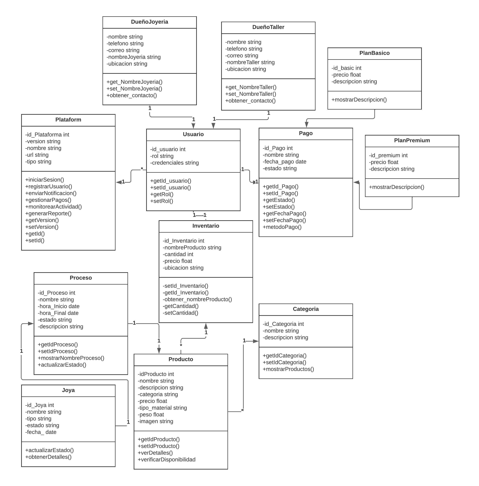
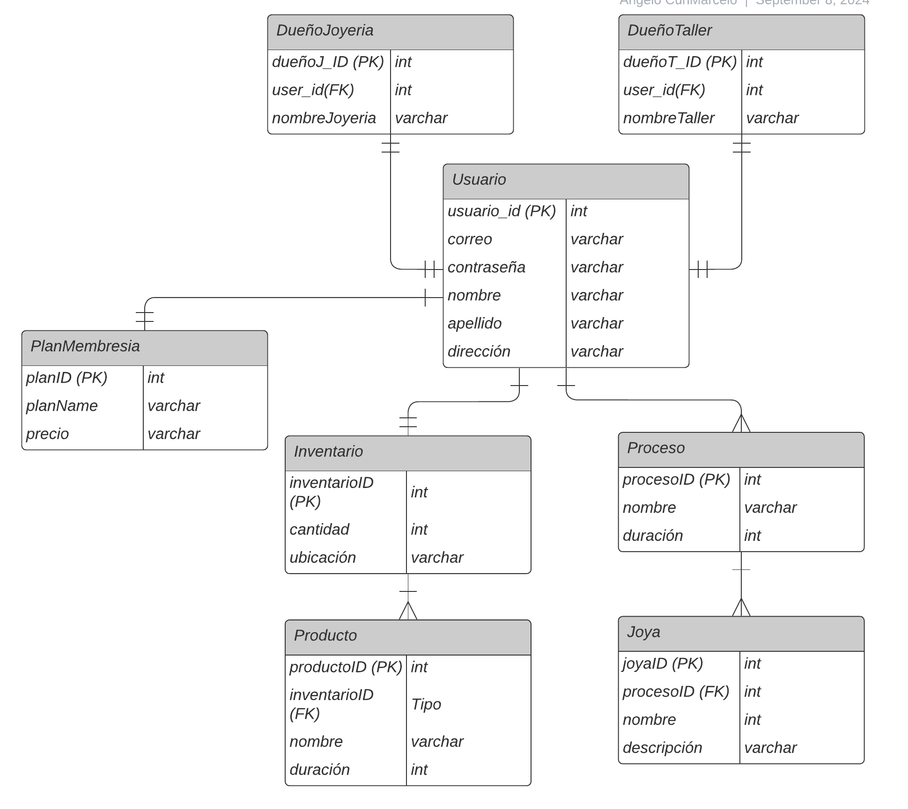

# Capítulo IV: Product Design

El diseño de productos será crucial para desarrollar soluciones que se centren en el usuario y aborden los problemas identificados. Este enfoque nos permitirá crear productos y servicios intuitivos y atractivos, alineados con las necesidades del usuario, lo que facilitará el logro de nuestros objetivos comerciales y generará valor para nuestros clientes.

# 4.1. Style Guidelines.

Un manual de estilo establece las pautas para redactar, diseñar y presentar diversos tipos de contenido, como documentos, sitios web y software. A continuación, se explican las normas específicas adoptadas para estructurar el proyecto.

## 4.1.1. General Style Guidelines.

### Branding
Para la creacion para nuestra startup Gemz, se ha optado por un estilo moderno y minimalista, de tal manera que se pueda transmitir una imagen de innovación y profesionalismo. Teniendo en cuenta que nos enforcamos en el sector de la joyería, se ha optado por un estilo elegante y sofisticado, que refleje la calidad y exclusividad de nuestros productos.


### Color Palette

La paleta de colores de GemZ se compone de tonos suaves y elegantes, que reflejan la calidad y exclusividad de nuestros productos. Los colores principales son el blanco en el fondo y el dorado en los elementos de diseño, que se complementan con tonos grises, ya que estos colores transmiten elegancia y sofisticación.


### Typography

La tipografía es un elemento clave en el diseño de GemZ, ya que influye en la legibilidad y la percepción de la marca. Se ha elegido la fuente `Montserrat` , por que es una fuente moderna y elegante, que se adapta perfectamente al estilo de la marca.


### spacing

El espaciado es un aspecto importante en el diseño de GemZ, ya que influye en la legibilidad y la organización de los elementos. Se ha establecido un espaciado uniforme de 8px entre los elementos, para crear una apariencia ordenada y equilibrada.


## 4.1.2. Web Style Guidelines.

Para GemZ, estamos desarrollando una plataforma web y vamos a implementar un diseño responsivo (Diseño Web Responsivo) para asegurar una presentación óptima de la información en todos los dispositivos, manteniendo la consistencia del contenido y mejorando la experiencia del usuario.
La estética general será limpia y moderna, con amplio espacio en blanco para permitir que las joyas brillen. Utilizaremos una paleta de colores que complemente la marca GemZ y evoque sentimientos de lujo y sofisticación. La tipografía será elegante y fácil de leer, garantizando una experiencia de navegación fluida.

# 4.2. Information Architecture.
## 4.2.1. Organization Systems.

El sistema de organización de GemZ se basa en una estructura modular y se centra en los siguientes temas:

**Header:** Contiene el logotipo, navegación principal y enlaces a la cuenta del usuario.
**Hero:** Presenta la propuesta de valor principal con una imagen y llamado a la acción.
**About Us:** Describe la empresa y su misión.
**Team:** Presenta a los miembros del equipo de desarrollo.
**Pricing:** Muestra los diferentes planes de suscripción.
**Testimonials:** Destaca las opiniones de los clientes.
**Contact:** Proporciona información de contacto y un formulario.
**Google Maps:** Muestra la ubicación de la empresa en un mapa interactivo.
**Footer:** Incluye enlaces adicionales, información de la empresa y redes sociales.
La organización visual del contenido sigue un patrón jerárquico, con las secciones más importantes en la parte superior, siguiendo un patrón de diseño en forma de "F".

## 4.2.2. Labeling Systems.

El sistema de etiquetado en GemZ se basa principalmente en texto claro y descriptivo para los títulos de las secciones, botones y enlaces de navegación. Se utilizan etiquetas HTML semánticas como `<h1>`, `<h2>`, `<nav>`, `<ul>`, `<li>`, etc., para estructurar el contenido y mejorar la accesibilidad.

## 4.2.3. SEO Tags and Meta Tags

El código HTML incluye algunas etiquetas meta relevantes para el SEO, como:

```
<!DOCTYPE html>
<html lang="en">

<head>
    <meta charset="UTF-8">
    <meta name="viewport" content="width=device-width, initial-scale=1.0">
    <title>GemZ - Gestión para Joyerías</title>
    <link rel="stylesheet" href="styles.css">
    <link rel="icon" href="./assets/logo2.png">
    <link rel="stylesheet" href="https://cdnjs.cloudflare.com/ajax/libs/font-awesome/6.6.0/css/all.min.css">
    <link href='https://unpkg.com/boxicons@2.1.4/css/boxicons.min.css' rel='stylesheet'>
</head>
```

Estas etiquetas ayudan a los motores de búsqueda a indexar y clasificar el contenido de la página, lo que mejora la visibilidad y la relevancia en los resultados de búsqueda.

## 4.2.4. Searching Systems.

Para el sistema de búsqueda de GemZ, va a permitir a los usuarios buscar joyas por categoría, precio, material, tamaño y otros atributos. La búsqueda se realizará en tiempo real, con resultados que se actualizan automáticamente a medida que el usuario escribe. Se utilizarán filtros y opciones de clasificación para ayudar a los usuarios a encontrar rápidamente lo que están buscando.

## 4.2.5. Navigation Systems.

GemZ utiliza los siguientes sistemas de navegación:

Navegación principal: Barra de navegación horizontal en la cabecera con enlaces a las secciones principales.

Menú hamburguesa: Menú desplegable para dispositivos móviles que incluye los mismos enlaces que la navegación principal.
Enlaces ancla: Enlaces internos que dirigen a secciones específicas dentro de la página en cual son: `Home`, `About-us`, `Subcriptions`, `Contact`, `My account`.

Enlaces contextuales: Botones y enlaces dentro de cada sección que llevan a contenido relacionado.
La navegación es clara e intuitiva, lo que permite a los usuarios encontrar fácilmente la información que buscan.

# 4.3. Landing Page UI Design.

En esta sección se presentan los diseños de la página de inicio de GemZ, que incluyen wireframes y mock-ups para mostrar la estructura y el diseño visual de la página.

## 4.3.1. Landing Page Wireframe.

En esta sección se presentan los wireframes de la página de inicio de GemZ, que muestran la estructura y el diseño de la página. sin incluir detalles visuales como colores y fuentes.

### - Wireframe pero para la vista del ordenador:


### - Wireframe pero para la vista del móvil.


## 4.3.2. Landing Page Mock-up.

En esta sección se presentan los mock-ups de la página de inicio de GemZ, que muestran el diseño visual completo de la página, incluyendo colores, fuentes e imágenes.


### - Mock-up para la vista del ordenador:


### - Mock-up para la vista del móvil.


# 4.4. Web Applications UX/UI Design.

El diseño UX/UI para aplicaciones web busca crear una experiencia digital intuitiva, eficiente y agradable. UX se enfoca en entender y mejorar la interacción del usuario, mientras que UI se centra en el aspecto visual y la disposición de elementos como botones y menús. Un buen diseño UX/UI combina estética y funcionalidad para ofrecer una experiencia de usuario efectiva y memorable.

## 4.4.1. Web Applications Wireframes.
Un wireframe es un diagrama visual que esboza el esqueleto de un proyecto o pieza tecnológica. A veces se conoce como esquema de la página o plano de la pantalla y muestra cómo se relacionan los elementos entre sí y cómo están estructurados. 

## Inicio e Inicio Mobile


## Registro


## Registro Mobile


## Inicio


## Inicio Mobile


## Perfil Y Perfil Mobile


## Inventario e Inventario Mobile


### Panel de Control y Panel de Control Mobile


## 4.4.2. Web Applications Wireflow Diagrams.
## 4.4.2. Web Applications Mock-ups.
## 4.4.3. Web Applications User Flow Diagrams.
# 4.5. Web Applications Prototyping.
# 4.6. Domain-Driven Software Architecture.

La arquitectura de software centrada en el dominio organiza el software según los conceptos y procesos clave de un área específica. Esto asegura que el sistema refleje con precisión los requisitos y la lógica del negocio, facilitando la implementación de funciones y adaptaciones. Con GemZ, usamos esta arquitectura para desarrollar una aplicación robusta y fácil de mantener.

## 4.6.1. Software Architecture Context Diagram.


## 4.6.2. Software Architecture Container Diagrams.


## 4.6.3. Software Architecture Components Diagrams.


# 4.7. Software Object-Oriented Design.

La metodología orientada a objetos será crucial para nuestro proyecto, nos ayudará a construir el sistema de manera modular y escalable, empleando principios como encapsulamiento, herencia y polimorfismo para crear componentes reutilizables y fáciles de mantener.

## 4.7.1. Class Diagrams.



## 4.7.2. Class Dictionary.

**Plataforma**
- Atributos: id_Plataforma,version,nombre,url,tipo
- Métodos: iniciarSesion(),registrarUsuario(),enviarNotificación(),gestionarPagos(),monitorearActividad(),generarReporte(),getVersion(),setVersion(),getId(),setId()

**Usuario**
- Atributos: id_usuario,rol,credenciales
- Métodos: getId_usuario(),setId_usuario(),getRol(),setRol()

**DueñoJoyeria**
- Atributos: nombre,telefono,correo,nombreJoyeria,ubicación
- Métodos: get_NombreJoyeria(),set_NombreJoyeria(),obtener_contacto()

**DueñoTaller**
- Atributos: nombre,telefono,correo,nombreTaller,ubicación
- Métodos: get_NombreJoyeria(),set_NombreTaller(),obtener_contacto()

**Pago**
- Atributos: id_Pago,nombre,fecha_pago,estado
- Métodos: getId_Pago(),setId_Pago(),getEstado(),setEstado(),getFechaPago(),setFechaPago(),metodoPago()

**PlanBasico**
- Atributos:id_basic,precio,descripción
- Métodos: mostrarDescripción()

**PlanPremium**
- Atributos:id_basic,precio,descripción
- Métodos: mostrarDescripción()

**Inventario**
- Atributos: id_inventario,nombreProducto,cantidad,precio,ubicación
- Métodos: setId_Inventario(),getId_Inventario(),obtener_nombreProducto(),getCantidad(),setCantidad()

**Producto**
- Atributos: idProducto, nombre,descripción,categoria,precio,precio,tipo,peso,imagen
- Métodos: getIdProducto(),setIdProducto(),verDetalles(),verificarDisponibilidad()

**Joya**
- Atributos: id_Joya,nombre,tipo,estado,fecha
- Métodos: actualizarEstado(),obtenerDetalles()

**Proceso**
- Atributos: id_Proceso,nombre,hora_inicio,hora_final,estado,descripción
- Métodos: getIdProceso(),setIdProceso(),mostrarNombreProceso(),actualizarEstado()

**Categoria**
- Atributos: id_Categoria,nombre,descripción
- Métodos: getIdCategoria(),setIdCategoria(),mostrarProductos()

# 4.8. Database Design.

El diseño de la base de datos es esencial para el proyecto, ya que definirá cómo almacenar y gestionar los datos de manera eficaz y segura. Crearemos tablas, relaciones y restricciones cuidadosamente, siguiendo las mejores prácticas para organizar los datos lógicamente y facilitar su acceso y manipulación.

## 4.8.1. Database Diagram



