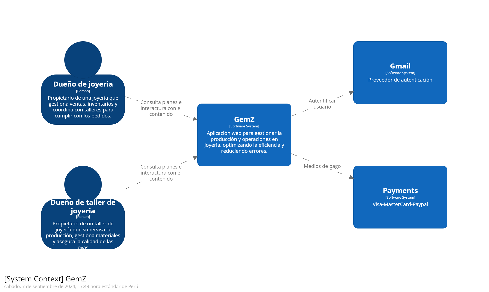
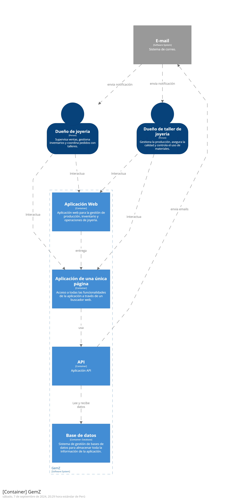
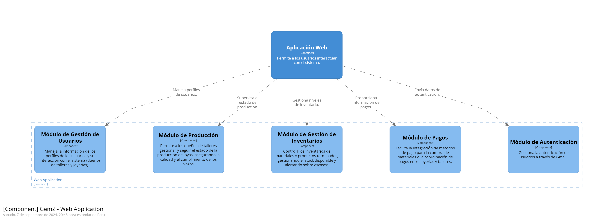

# Capítulo IV: Product Design

El diseño de productos será crucial para desarrollar soluciones que se centren en el usuario y aborden los problemas identificados. Este enfoque nos permitirá crear productos y servicios intuitivos y atractivos, alineados con las necesidades del usuario, lo que facilitará el logro de nuestros objetivos comerciales y generará valor para nuestros clientes.

# 4.1. Style Guidelines.

Un manual de estilo establece las pautas para redactar, diseñar y presentar diversos tipos de contenido, como documentos, sitios web y software. A continuación, se explican las normas específicas adoptadas para estructurar el proyecto.

## 4.1.1. General Style Guidelines.
## 4.1.2. Web Style Guidelines.
# 4.2. Information Architecture.
## 4.2.1. Organization Systems.
## 4.2.2. Labeling Systems.
## 4.2.3. SEO Tags and Meta Tags
## 4.2.4. Searching Systems.
## 4.2.5. Navigation Systems.
# 4.3. Landing Page UI Design.
## 4.3.1. Landing Page Wireframe.
## 4.3.2. Landing Page Mock-up.
# 4.4. Web Applications UX/UI Design.

El diseño UX/UI para aplicaciones web busca crear una experiencia digital intuitiva, eficiente y agradable. UX se enfoca en entender y mejorar la interacción del usuario, mientras que UI se centra en el aspecto visual y la disposición de elementos como botones y menús. Un buen diseño UX/UI combina estética y funcionalidad para ofrecer una experiencia de usuario efectiva y memorable.

## 4.4.1. Web Applications Wireframes.
## 4.4.2. Web Applications Wireflow Diagrams.
## 4.4.2. Web Applications Mock-ups.
## 4.4.3. Web Applications User Flow Diagrams.
# 4.5. Web Applications Prototyping.
# 4.6. Domain-Driven Software Architecture.

La arquitectura de software centrada en el dominio organiza el software según los conceptos y procesos clave de un área específica. Esto asegura que el sistema refleje con precisión los requisitos y la lógica del negocio, facilitando la implementación de funciones y adaptaciones. Con GemZ, usamos esta arquitectura para desarrollar una aplicación robusta y fácil de mantener.

## 4.6.1. Software Architecture Context Diagram.

## 4.6.2. Software Architecture Container Diagrams.

## 4.6.3. Software Architecture Components Diagrams.

# 4.7. Software Object-Oriented Design.

La metodología orientada a objetos será crucial para nuestro proyecto, nos ayudará a construir el sistema de manera modular y escalable, empleando principios como encapsulamiento, herencia y polimorfismo para crear componentes reutilizables y fáciles de mantener.

## 4.7.1. Class Diagrams.
## 4.7.2. Class Dictionary.
# 4.8. Database Design.
## 4.8.1. Database Diagram
