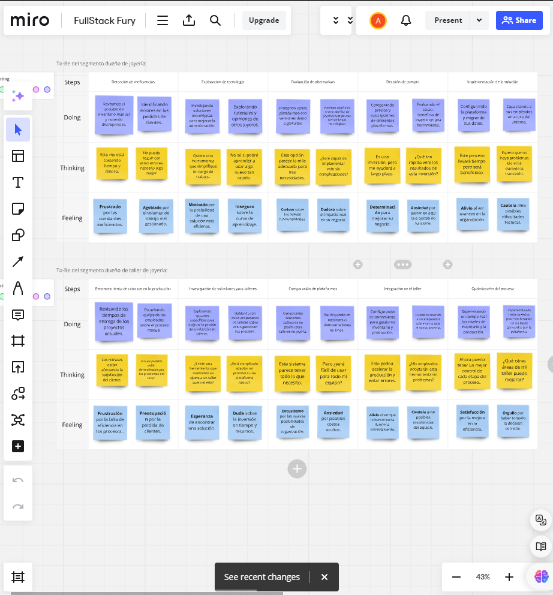
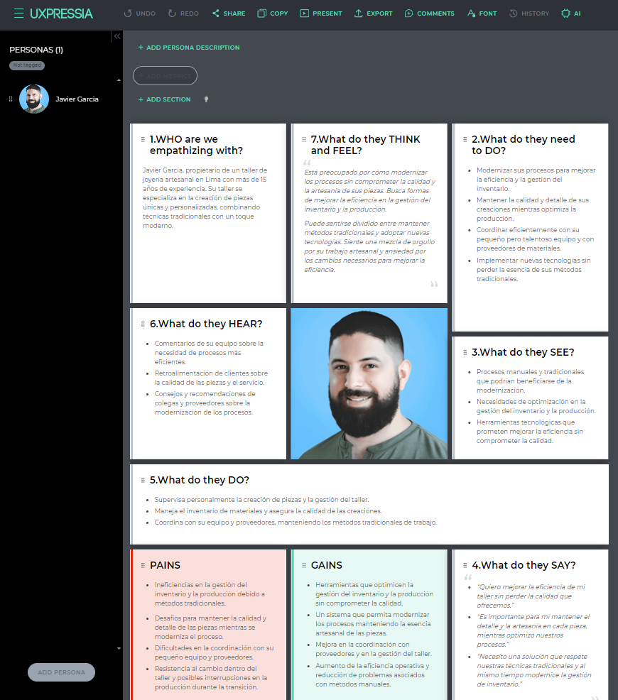
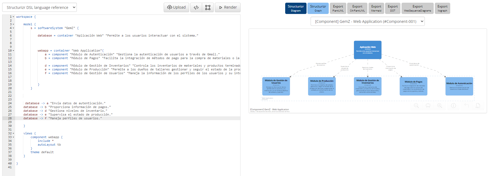
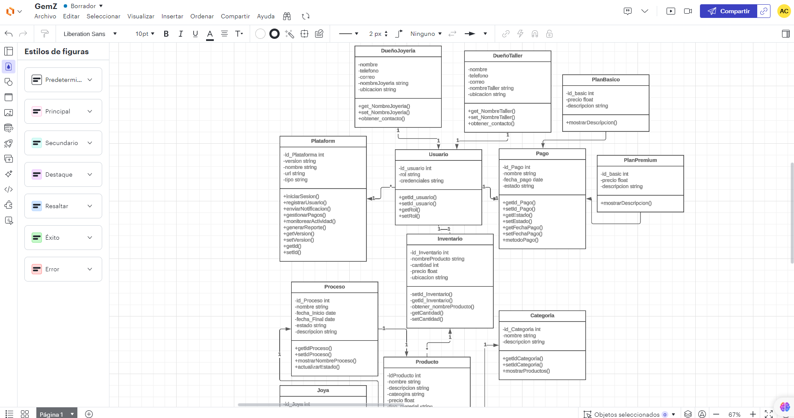
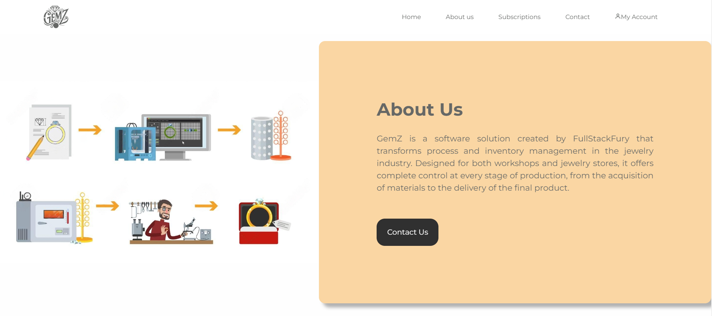
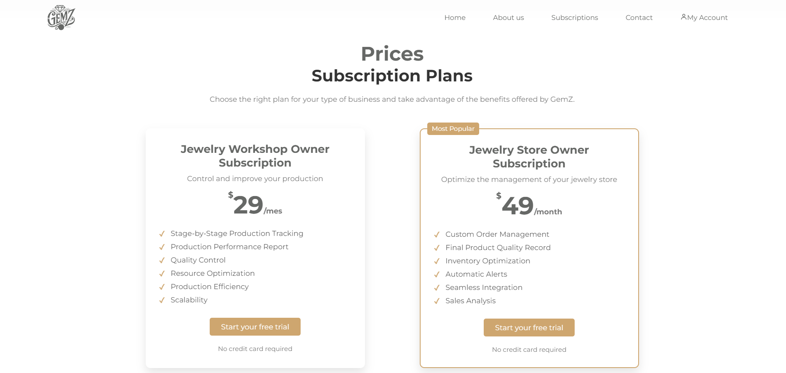
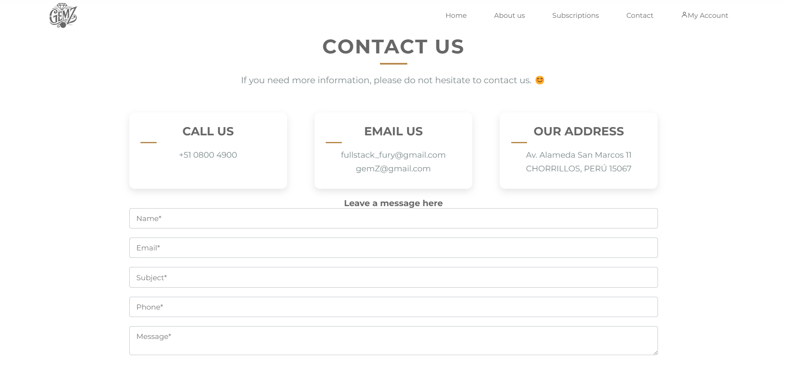
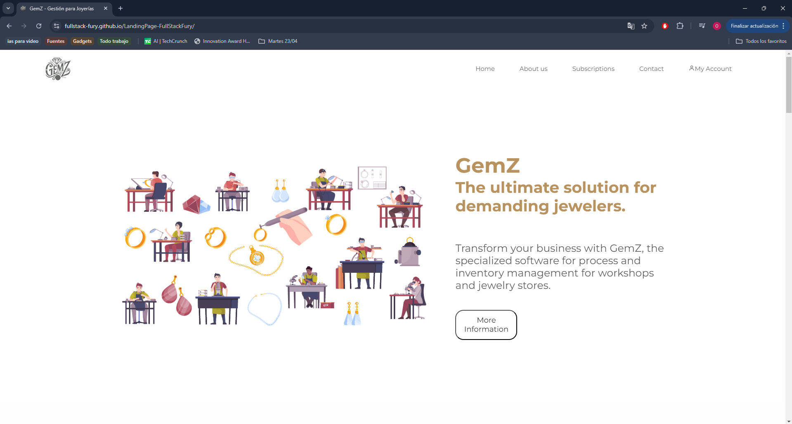
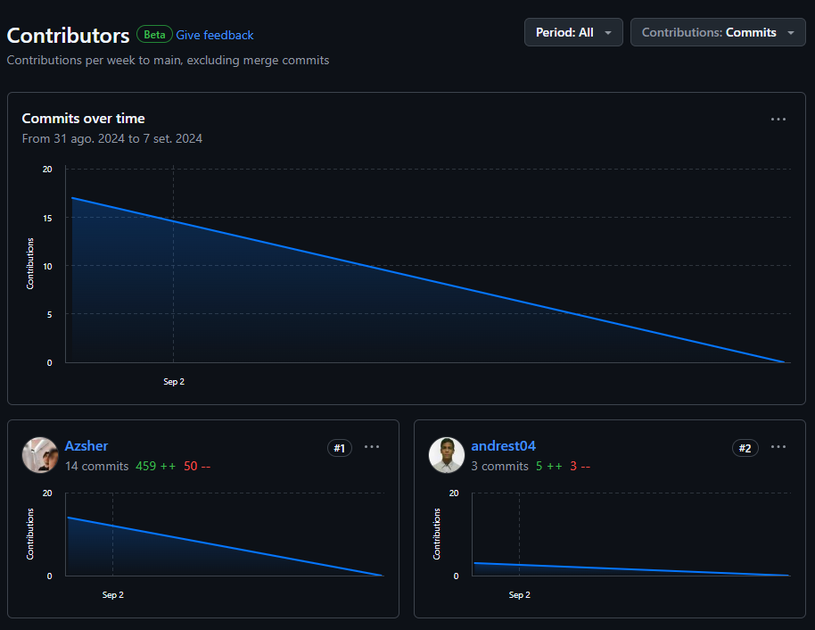
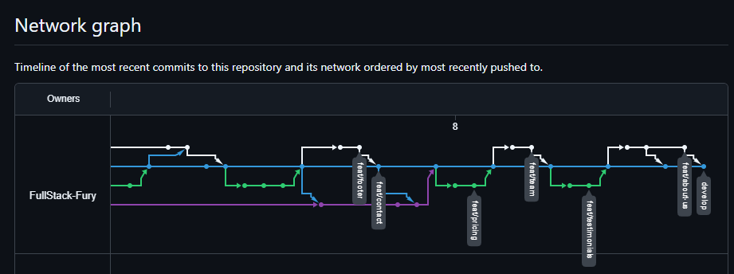

# Capítulo V: Product Implementation, Validation & Deployment

La implementación, validación y despliegue del producto son esenciales para asegurar que la visión del producto se materialice en una solución funcional y accesible para nuestros usuarios. Estas fases nos permiten transformar el diseño conceptual en una aplicación efectiva, probada y lista para su uso, lo que facilita la verificación de nuestras ideas, la identificación de posibles problemas y la entrega de una experiencia de usuario de alta calidad.

## 5.1. Software Configuration Management.

La administración de la configuración del software es fundamental para nuestro trabajo, ya que nos permite mantener un control exacto sobre los componentes de nuestro proyecto, como el código fuente, los documentos de diseño y los recursos digitales. Esto asegura que todos los miembros del equipo trabajen con la misma versión de los archivos y facilita la colaboración entre desarrolladores, diseñadores y otros profesionales involucrados en el proyecto.

## 5.1.1. Software Development Environment Configuration.

- **Project Management**:

- Trello: 
    Es una aplicación web que permite organizar tareas y proyectos en tableros que facilita el seguimiento de las actividades de un equipo de trabajo.
    Página principal de Trello: https://trello.com/

- Microsoft Stream: 
    Una plataforma de video empresarial que permite a las organizaciones crear, administrar y compartir videos de manera segura. Usamos esta platamorma para almacenar los videos de las entrevitas realizadas a los segmentos de objetivos.
    Página principal de Microsoft Stream: https://www.microsoft.com/es-es/microsoft-365/microsoft-stream

- Miro:
    Es una plataforma de colaboración en línea que permite a los equipos colaborar en tiempo real, compartir ideas y trabajar juntos en un entorno virtual. Usamos esta plataforma para realizar parte del lean UX Process, AS-IS scenario mapping y TO-BE scenario mapping.
    Link de descarga de Miro: https://miro.com/es/app/

  

- **User Research**:

- UXPressia: 
    Es una herramienta de mapeo de experiencia del cliente que permite a los equipos crear mapas de experiencia del cliente, mapas de viaje del cliente y otros diagramas de experiencia del cliente. Usamos esta herramienta para realizar el Customer Journey Map, impact mapping.
    Página principal de UXPressia: https://uxpressia.com/

- Structurizr: 
    Es una herramienta de modelado de software que permite a los equipos crear diagramas de arquitectura de software y documentación de arquitectura de software de modelos C4. Usamos esta herramienta para crear diagramas de arquitectura de software.
    Página principal de Structurizr: https://structurizr.com/

- **Product UX/UI Design**:

- Figma: 
    Es una herramienta de diseño de interfaz de usuario basada en la web que permite a los equipos de diseño crear prototipos de diseño de interfaz de usuario y colaborar en tiempo real. Usamos esta herramienta para crear prototipos de diseño de la landing page.
    Página principal de Figma: https://www.figma.com/es-la/downloads/

- Lucidchart: 
    Es una herramienta de diagramación en línea que permite a los equipos crear diagramas de flujo, diagramas de red, diagramas de arquitectura y otros diagramas. Usamos esta herramienta para crear diagramas el diagramas de clases y el diagrama de base de datos.
    Página principal de Lucidchart: https://www.lucidchart.com/

- **Software Development**:

- HTML5:
    Es la última versión de HTML que permite a los desarrolladores web crear sitios web y aplicaciones web interactivas y receptivas. Usamos HTML5 para crear la estructura de la landing page.
    Página sobre documentación de HTML5: https://developer.mozilla.org/en-US/docs/Glossary/HTML5

- CSS3:
    Es la última versión de CSS que permite a los desarrolladores web diseñar y personalizar la apariencia de los sitios web y aplicaciones web. Usamos CSS3 para diseñar la apariencia de la landing page.
    Página sobre documentación de CSS3: https://developer.mozilla.org/en-US/docs/Glossary/CSS

- JavaScript: 
    Es un lenguaje de programación de alto nivel que permite a los desarrolladores web crear sitios web y aplicaciones web interactivas y dinámicas. Usamos JavaScript para agregar interactividad y dinamismo a la landing page.
    Página sobre documentación de JavaScript: https://developer.mozilla.org/en-US/docs/Glossary/JavaScript

-   WebStrom:
    Es un entorno de desarrollo integrado (IDE) que permite a los desarrolladores web crear, editar y depurar código web. Usamos WebStorm para escribir y editar el código HTML, CSS y JavaScript de la landing page.
    Página principal de WebStorm: https://www.jetbrains.com/es-es/webstorm/download/#section=windows 

- **Software Documentation**:

-  GitHub:
    Es una plataforma de desarrollo de software basada en la web que permite a los desarrolladores colaborar en proyectos de software, alojar y revisar código, y realizar un seguimiento de problemas y solicitudes de extracción. Usamos GitHub para alojar y gestionar el código fuente de la landing page.
    Página principal de GitHub: https://github.com/

- Git:
    Es un sistema de control de versiones distribuido que permite a los desarrolladores rastrear los cambios en el código fuente de un proyecto de software. Usamos Git para controlar y gestionar las versiones del código fuente de la landing page.
    Página principal de Git: https://git-scm.com/
## 5.1.2. Source Code Management.

## 5.1.3. Source Code Style Guide & Conventions.

Como norma general, se espera que todo el código desarrollado por los miembros del equipo esté completamente redactado en inglés.
- ### HTML 
    - #### Use Lowercase Element Names:
        Es recomendable utilizar minúsculas o lowercase para los nombres de los elementos HTML.
        ~~~ 
      <body>
            
This is a paragraph

      <body>
       ~~~
    - #### Close All HTML Elements:
        Es recomendable cerrar todos los elementos HTML correctamente.
        ~~~ 
      <body>
            
This is a paragraph

            
This is another paragraph

      <body>
       ~~~
    - #### Use Lowercase Attribute Names:
        Es recomendable utilizar minúsculas para los nombres de los atributos HTML.
      ~~~ 
      <a href="https://www.w3schools.com/html/">Visit our HTMLtutorial</a>
       ~~~
    - #### Always Specify alt, width, and height for Images:
      Es recomendable seguir estas convenciones en caso de que la imagen no se pueda mostrar, lo que ayuda a mejorar la accesibilidad del contenido.
      ~~~ 
      
      ~~~ 
    - #### Spaces and Equal Signs:
      Se recomienda no utilizar espacios en blanco entre las entidades para mejorar la legibilidad.
      ~~~ 
      <link rel="stylesheet" href="styles.css">
      ~~~ 
- ### CSS
    - #### ID and Class Naming
      Es recomendable utilizar nombres de clases e id's significativos que expresen claramente el propósito del elemento.
      ~~~ 
      #gallery {}
      #login {}
      .video {}
       ~~~
    - #### ID and Class Name Style
      Se recomienda utilizar nombres cortos para nombrar ids o clases, pero lo suficientemente descriptivos para entender su propósito.
      ~~~ 
      #nav {}
      .author {}
      ~~~
    - #### Shorthand Properties
      Se recomienda utilizar propiedades CSS de forma abreviada siempre que sea posible para hacer el código más eficiente y comprensible.
       ~~~ 
       border-top: 0;
       font: 100%/1.6 palatino, georgia, serif;
       padding: 0 1em 2em;
       ~~~ 
    - #### 0 and Units
      Es recomendable evitar especificar la unidad después del valor 0 en propiedades que lo permitan, ya que esto ayuda a reducir el tamaño del código y mejora su legibilidad.
       ~~~ 
       margin: 0;
       padding: 0;
       ~~~
     - #### Declaration Order
       Se recomienda ordenar las declaraciones en orden alfabético para facilitar el mantenimiento y la recordación del código.
       ~~~ 
        background: fuchsia;
        border: 1px solid;
        border-radius: 4px;
        color: black;
        text-align: center;
        text-indent: 2em;
       ~~~  
- ### JAVASCRIPT
     - #### Use expanded syntax
       Cada línea de JavaScript debería estar en una nueva línea, con la llave de apertura en la misma línea de su declaración y la llave de cierre en una nueva línea al final.
       ~~~ 
       function myFunc() {
        console.log('Hello!');
       };
       ~~~
     - #### Variable naming
       Para el nombre de las variables, se recomienda utilizar lowerCamelCase. 
       ~~~ 
       let playerScore = 0;
       let speed = distance / time;
       ~~~  
     - #### Declaring variables
       Para la declaración de variables, es recomendable utilizar las palabras reservadas let y const en lugar de var.
       ~~~ 
       const myName = 'Chris';
       console.log(myName);
       let myAge = '40';
       myAge++;
       console.log('Happy birthday!');
       ~~~ 
     - #### Function naming
       Para el nombre de las funciones, se recomienda utilizar lowerCamelCase.
       ~~~ 
       function sayHello() {
       alert('Hello!');
       };
       ~~~ 
- ### C#
    - #### PascalCase
      Mayúscula al principio de cada palabra para nombres de clases y métodos.
      ~~~ 
      public class MyClass {
          public void ExampleMethod() {
              // Method code
          }
      }
      ~~~
    - #### camelCase
      Minúscula al principio con mayúsculas para cada palabra subsiguiente para variables y parámetros.
      ~~~ 
      public class MyClass {
          public void ExampleMethod(int exampleNumber) {
              string exampleName = "Example";
              // Method code     
          }
      }
      ~~~
      - #### Reasonable line length
        Mantener líneas de código con longitud adecuada para mejorar la legibilidad.
        ~~~ 
        public class MyClass {
            public void ExampleMethod() {
                string message = "This is an example message that spans multiple lines " +
                                 "to demonstrate how to maintain a reasonable length.";
                 Console.WriteLine(message);  
          }
        }
        ~~~ 
      - #### Clear comments:
          Utilizar comentarios para explicar el propósito del código de manera concisa.
          ~~~ 
          public class MyClass {
              // This method performs an addition operation and returns the result.
              public int Add(int a, int b) {
                return a + b;
               }
          }
          ~~~
    - #### Single responsibility:
      Cada clase o método debe tener una única función bien definida.
      ~~~ 
      // Class responsible for handling basic mathematical operations
      public class MathematicalOperations {
          // Method to add two numbers
          public int Add(int a, int b) {
              return a + b; 
          } 
       
          // Method to subtract two numbers
          public int Subtract(int a, int b) { 
              return a - b; 
          } 
      }
      ~~~
- ### LENGUAJE GHERKIN
    - #### Descriptive and concise titles for scenarios
      Utilizar títulos descriptivos y concisos para los escenarios.
      ~~~ 
      Feature: Login
        Scenario: Successful login
          Given a user is on the login page     
          When they enter valid credentials     
          Then they should be logged in successfully      
      ~~~
    - #### Follow the Given-When-Then structure consistently.
      Seguir la estructura de Given-When-Then de manera consistente.
      ~~~ 
      Scenario: Adding items to the shopping cart
        Given the user is on the shopping page
        When they add an item to the cart
        Then the item should appear in the cart 
      ~~~
    - #### Focus on business-readable language
      Centrarse en un lenguaje legible para el negocio, evitando detalles técnicos de implementación.
      ~~~ 
      Scenario: Changing user settingst
        Given the user is logged in
        When they navigate to the settings page
        Then they should be able to update their profile
      ~~~
    - ####  Utilize Scenario Outline for scenarios with multiple similar cases.
      Utilizar Scenario Outline para escenarios con múltiples casos similares.
      ~~~ 
      Scenario Outline: Searching for products
        Given the user is on the search page
        When they search for "<product>"
        Then they should see search results for "<product>"
      
      Examples:
        |   product  |
        |   Laptop   |
        | Smartphone |
      ~~~
    - #### Add comments to provide additional context
      Agregar comentarios para proporcionar contexto adicional o explicaciones cuando sea necesario.
      ~~~ 
      # This scenario checks the functionality of the logout feature
      Scenario: User logout
        Given the user is logged in
        When they click on the logout button
        Then they should be redirected to the login page      
      ~~~
      

## 5.1.4. Software Deployment Configuration.

    Paso para crear el ambiente de desarrollo en la landing page:

Link de la landing page: [Landing Page]("")

1. Crear un repositorio en GitHub.
  

2. Agregar participantes al repositorio.
  

3. Habilitamos GitHub Pages en branch "master" y ruta "/(root)"
  

## 5.2. Landing Page, Services & Applications Implementation.

Desarrollar la página de inicio, los servicios y las aplicaciones es un componente esencial de nuestro proceso de desarrollo. Esta etapa convierte el diseño y la funcionalidad previstos en productos reales y operativos. Nos permite transformar las especificaciones y requisitos en código efectivo, construyendo la estructura de la página, los servicios y las aplicaciones según las necesidades definidas.

## 5.2.1. Sprint 1

El primer sprint representa un momento clave en nuestro desarrollo ágil. Durante esta etapa, nos dedicamos a implementar las características y funcionalidades prioritarias que se definieron en la planificación inicial. Este proceso implica transformar los requisitos y especificaciones en código operativo, sentando las bases de nuestro producto de manera progresiva.

## 5.2.1.1. Sprint Planning 1.

En la metodología ágil, la reunión de planificación del sprint es fundamental para preparar el trabajo del próximo sprint. En esta fase, el equipo decide qué tareas se abordarán, estima el tiempo necesario para cada una y asigna responsabilidades. El objetivo es desarrollar un plan bien definido y alcanzable, promoviendo el trabajo en equipo y asegurando que todos los miembros estén claros sobre las metas y prioridades del sprint.

<table  style="text-align: center;">
    <tbody>
        <tr>
			<td colspan="1">Sprint 1</td>
            <td colspan="1"> Sprint n </td>
		</tr>
        <tr>
			<td colspan="2">Sprint Planning Background </td>
		</tr>
        <tr>
			<td colspan="1">Date</td>
            <td colspan="1"> 2024-09-07 </td>
		</tr>
        <tr>
			<td colspan="1">Time</td>
            <td colspan="1"> 21:00 PM </td>
		</tr>
        <tr>
			<td colspan="1">Location</td>
            <td colspan="1"> Microsot Teams  </td>
		</tr>
        <tr>
			<td colspan="1">Prepared By</td>
            <td colspan="1"></td>
		</tr>
        <tr>
			<td colspan="1"> Attendees (to planning meeting)</td>
            <td colspan="1"> Quijandria Araneda, Vicente / Antayhua Castillo, Oscar / Torres García, Andrés / Rentería Palacios, Yasser / Curi Marcelo, Angelo </td>
		</tr>
         <tr>
			<td colspan="1">Sprint 1 – 1 Review Summary </td>
            <td colspan="1">Se lograron los objetivos del producto, incluyendo la finalización de todos los capítulos, el lanzamiento de la Landing Page y la integración de la mayoría de la información en el reporte.</td>
		</tr>
         <tr>
			<td colspan="1">Sprint 1 – 1 Retrospective Summary </td>
            <td colspan="1">El Sprint 1 enfrentó desafíos en la gestión del tiempo, lo que afectó el progreso de los capítulos. El Líder del equipo propuso las siguientes acciones para mejorar: "Aumentar la implicación de cada miembro del equipo, realizar reuniones diarias para monitorear el avance del proyecto, mejorar la comunicación interna y optimizar el uso de herramientas de software para el manejo de tareas en cada sprint." En el siguiente Sprint, se pondrán en práctica estas sugerencias para mejorar los resultados.</td>
		</tr>
         <tr>
			<td colspan="2">Sprint Goal & User Stories </td>
		</tr>
         <tr>
			<td colspan="1">Sprint 1 Goal</td>
            <td colspan="1"> Para este sprint, el objetivo es desarrollar los elementos fundamentales de la Landing Page, incluyendo su estructura, diseño y navegación. Además, se completará un reporte detallado que documenta el proyecto de software desde el inicio hasta el final. Estos logros son esenciales para establecer una base sólida para nuestro producto y garantizar una experiencia de usuario fluida y efectiva. </td>
		</tr>
        <tr>
			<td colspan="1">Sprint 1 Velocity </td>
            <td colspan="1">Para este sprint se decidió trabajar con 5 User Stories, cada una valorada en 5 Story Points</td>
		</tr>
        <tr>
			<td colspan="1">Sum of Story Points </td>
            <td colspan="1">25</td>
		</tr>
</tbody>
</table>

## 5.2.1.2. Sprint Backlog 1.

En esta primera etapa, nos enfocamos en armar lo básico de la Landing Page: la estructura, cómo se ve y cómo la gente se mueve por ella. También hicimos un reporte que cuenta la historia completa de nuestro proyecto de software, de principio a fin. Esto es clave para que nuestro producto tenga una buena base y la gente lo use sin problemas.

<table>
	<tbody>
		<tr>
			<td>Sprint #</td>
			<td colspan="7">Sprint 1</td>
		</tr>
		<tr>
			<td colspan="2">User Story</td>
			<td colspan="6">Work - Item / Task</td>
		</tr>
		<tr>
			<td>Id</td>
			<td>Title</td>
			<td>Id</td>
			<td>Title</td>
			<td>Description</td>
			<td>Estimation (Hours)</td>
			<td>Assigned To</td>
			<td>Status (To-do / In-Process / To-Review / Done)</td>
		</tr>
		<tr>
			<td></td>
			<td></td>
			<td>TSK001</td>
			<td>Setting up a remote environment for the Report and Landing Page</td>
			<td>Setting up organization, repositories, and branches on GitHub</td>
			<td>0</td>
			<td>Torres García, Andrés</td>
			<td>Done</td>
		</tr>
		<tr>
			<td></td>
			<td></td>
			<td>TSK002</td>
			<td>Conclude Chapter01</td>
			<td>Complete all sections and include the relevant information in Chapter01</td>
			<td>5</td>
			<td>team members</td>
			<td>Done</td>
		</tr>
		<tr>
			<td></td>
			<td></td>
			<td>TSK003</td>
			<td>Conclude Chapter02</td>
			<td>Complete all sections and include the relevant information in Chapter02</td>
			<td>4</td>
			<td>All team members</td>
			<td>Done</td>
		</tr>
		<tr>
			<td></td>
			<td></td>
			<td>TSK004</td>
			<td>Conclude Chapter03</td>
			<td>Complete all sections and include the relevant information in Chapter03</td>
			<td>6</td>
			<td>All team members</td>
			<td>Done</td>
		</tr>
		<tr>
			<td></td>
			<td></td>
			<td>TSK005</td>
			<td>Conclude Chapter04</td>
			<td>Complete all sections and include the relevant information in Chapter04</td>
			<td>15</td>
			<td>All team members</td>
			<td>Done</td>
		</tr>
		<tr>
			<td></td>
			<td></td>
			<td>TSK006</td>
			<td>Conclude Chapter05</td>
			<td>Complete all sections and include the relevant information in Chapter05</td>
			<td>4</td>
			<td>All team members</td>
			<td>Done</td>
		</tr>
    <tbody>
</table>

## 5.2.1.3. Development Evidence for Sprint Review.

En este primer sprint, nos centramos en sentar las bases de nuestra solución, priorizando la Landing Page y la documentación esencial para el proyecto. Primero, se mostrarán los commits más importantes para el Reporte:

<table>
  <thead>
    <tr>
      <th>Repository</th>
      <th>Branch</th>
      <th>Commit ID</th>
      <th>Commit Message</th>
      <th>Commit Message Body</th>
      <th>Commited on (Date)</th>
    </tr>
  </thead>
  <tbody>
    <tr>
      <td>""</td>
      <td>develop</td>
      <td>98783487238973c5dd4a8097197adb2cf70af00a</td>
      <td>feat: added content in chapter IV</td>
      <td>added content in all sections of chapter04</td>
      <td>4/9/2024</td>
    </tr>
  </tbody>
</table>

A continuación se presentan los commits más importantes para la Landing Page:

<table>
  <thead>
    <tr>
      <th>Repository</th>
      <th>Branch</th>
      <th>Commit ID</th>
      <th>Commit Message</th>
      <th>Commit Message Body</th>
      <th>Commited on (Date)</th>
    </tr>
  </thead>
  <tbody>
    <tr>
      <td>""</td>
      <td>develop</td>
      <td>98783487238973c5dd4a8097197adb2cf70af00a</td>
      <td>feat: added content in chapter IV</td>
      <td>added content in all sections of chapter04</td>
      <td>4/9/2024</td>
    </tr>
  </tbody>
  </table>

## 5.2.1.4. Testing Suite Evidence for Sprint Review.
Al no contar con una implementación del lado del backend en esta engrega, solo se utiliza los appetance criteria para ello 

| **Feature** | Como visitante quiero conocer las principales funciones de la aplicación a través de la landing page para evaluar su utilidad y posible uso. |
|-------------|--------------------------------------------------------------------------------------------------------------------------------------------------|
| **Escenario 1** | **El potencial cliente quiere contactarnos**  **Dado que**: el cliente está en la landing page. **Cuando**: selecciona la opción de "Contacto" desde el menú de navegación. **Entonces**: podrá ver de una manera concisa y organizada las principales características de la app. |
| **Escenario 2** | **El visitante quiere información sobre Planes de Suscripción**  **Dado que**: el cliente está en la landing page. **Cuando**: selecciona la opción de "Suscriptions" desde el menú de navegación. **Entonces**: el sistema lo redirige a la sección de precios de suscripción, mostrando los dos planes disponibles: uno para talleres de joyería y otro para dueños de joyerías, junto con detalles de costos y beneficios asociados. |
| **Escenario 3** | **El visitante conoce nuestro startup**  **Dado que**: que el cliente está en la landing page  **Cuando**: selecciona la opción de "About Us" desde el menú de navegación.  **Entonces**: el sitio web lo redirigirá hacia el apartado con detalles de información acerca de la startup. |

## 5.2.1.5. Execution Evidence for Sprint Review.

## 5.2.1.6. Services Documentation Evidence for Sprint Review.
En la presene entrega no existe implementación a nivel de backend, ya que el alcance del sprint está abocado al landing page.
## 5.2.1.7. Software Deployment Evidence for Sprint Review.
Link de la pagina desplegada: [GemZ (Fullstack-fury.github.io/LandingPage-FullStackFury/)]("https://fullstack-fury.github.io/LandingPage-FullStackFury/")

## 5.2.1.8. Team Collaboration Insights during Sprint.

Dado que el alcance del presente sprint se aboca al desarrollo de landing page, nuestro equipo de trabajo decidió seccionar la información de la startup de modo que cada miembro pueda contar con participación en esta entrega.

A continuación se adjunta la imagen de los commits de cada integrante como colaboradores en el repositorio.

## 5.3. Validation Interviews.
## 5.3.1. Diseño de Entrevistas.
## 5.3.2. Registro de Entrevistas.
## 5.3.3. Evaluaciones según heurísticas.
## 5.4. Video About-the-Product.
 
# Conclusiones
## Conclusiones y recomendaciones.

- Durante el desarrollo de la plataforma GemZ, el equipo ha logrado implementar con éxito las funcionalidades clave y características planificadas, proporcionando una solución integral para la gestión de la producción y el inventario en el sector de la joyería.

- La implementación inicial de GemZ ha demostrado la capacidad del equipo para transformar los requisitos y especificaciones en una herramienta funcional, con una estructura robusta y un diseño que se alinea con las necesidades del usuario.

- La colaboración y el trabajo en equipo han sido cruciales para el éxito del proyecto, permitiendo a los miembros aportar sus conocimientos, habilidades y recursos para alcanzar los objetivos establecidos.

- El enfoque ágil ha sido efectivo para la implementación de GemZ, permitiendo al equipo adaptarse a cambios y desafíos de manera eficiente y mejorar continuamente el producto según el feedback recibido.

## Video About-the-Team.
# Bibliografía

- Cohn, M. (2004). User stories applied: For agile software development. Addison-Wesley Professional. Retrieved from : https://athena.ecs.csus.edu/~buckley/CSc191/User-Stories-Applied-Mike-Cohn.pdf
- Toomey, J. W. (2000). Inventory management: Principles, concepts and techniques. Springer Science & Business Media. Retrieved from : https://books.google.com.pe/books?id=kgX_GPqCYBgC&printsec=frontcover#v=onepage&q&f=false
- Gothelf, J., & Seiden, J. (2021). Lean UX, 3rd Edition. O'Reilly Media. Retrieved from : https://learning.oreilly.com/library/view/lean-ux-3rd/9781098116293/
- Oracle. (n.d.). Redwood. Oracle.  Retrieved from : https://redwood.oracle.com/

# Anexos
